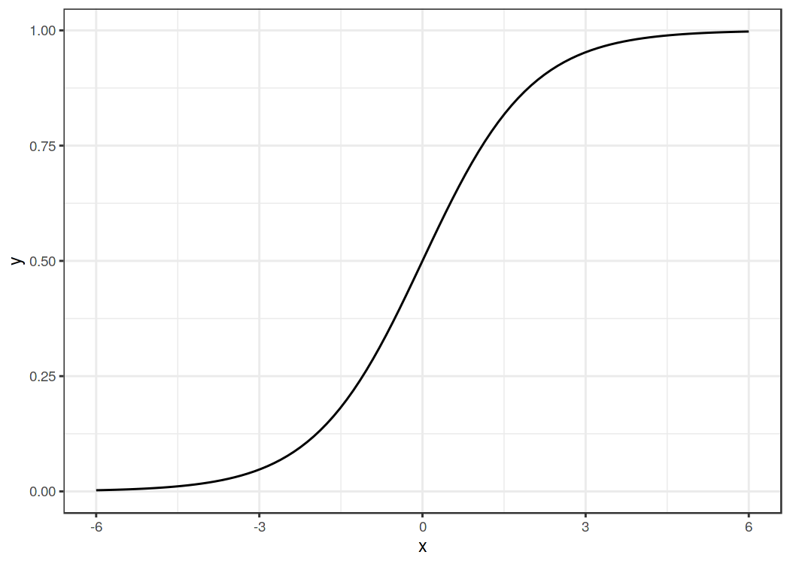
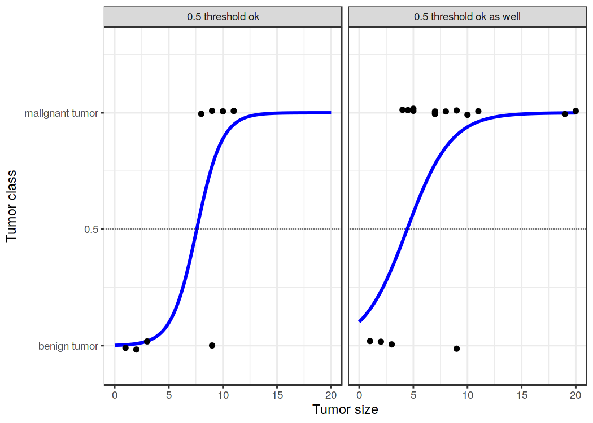

## Logistic Regression {#logistic}
Logistic regression is the equivalent of the linear regression model for classification problems.
Logistic regression models the probabilities for classification problems with two possible outcomes.

### What's Wrong with Linear Regression for Classification?
The  linear regression model can work well for regression, but fails for classification.
Why is that?
In case of two classes, you could label one of the classes with 0 and the other with 1 and use a linear model.
Technically it works and most linear model programs will spit out weights for you.
But there are a few problems with this approach:

- A linear model doesn't output probabilities, but it treats the classes as numbers (0 and 1) and fits the best hyperplane (for a single feature, it's a line) that minimizes the distances between the points and the hyperplane.
So it simply interpolates between the points, and you can't interpret it as probabilities.
- Also, a linear model extrapolates and gives you values below zero and above one.
This is a good sign that there might be a smarter approach to classification.
- Since the predicted outcome is not a probability, but some linear interpolation between points, there is no meaningful threshold at which you can distinguish one class from the other.
A good illustration of this issue has been given on [Stackoverflow](https://stats.stackexchange.com/questions/22381/why-not-approach-classification-through-regression)
- Linear models don't extend to classification problems with multiple classes.
You would have to start labeling the next class with a 2, then 3, and so on.
The classes might not have any meaningful order, but the linear model would force a weird structure on the relationship between the features and your class predictions.
The higher the value of a feature with a positive weight, the more it contributes to the prediction of a class with a higher number.
Even if classes that happen to get a similar number are not closer than other classes.

![A linear model is trained on artificial data to classify a tumor as malignant (1) or benign (0), depending on tumor size. Each point is a tumor, the x-axis shows the size of the tumor, the y-axis the malignancy, points are slightly jittered to reduce over-plotting. The lines show the prediction of the linear model. For the data on the left, we can use 0.5 as classification threshold. After introducing a few more malignant tumor cases, the regression line shifts and a threshold of 0.5 no longer separates the classes.](images/linear-class-threshold-1.png)

### Theory
A solution for classification is logistic regression.
Instead of fitting a straight line or hyperplane, the logistic regression model uses the logistic function to squeeze the output of a linear equation between 0 and 1.
The logistic function is defined as:

{$$}\text{logistic}(\eta)=\frac{1}{1+exp(-\eta)}{/$$}

And it looks like this:

The step from linear regression  to logistic regression is kind of straightforward.
In the linear regression model, we have modelled the relationship between the outcome and the features with a linear equation:

{$$}\hat{y}_{i}=\beta_{0}+\beta_{1}x_{i,1}+\ldots+\beta_{p}x_{i,p}{/$$}

For classification, we prefer probabilities between 0 and 1, so we wrap the right side of the equation into the logistic function.
This forces the output to assume only values between 0 and 1.

{$$}P(y_{i}=1)=\frac{1}{1+exp(-(\beta_{0}+\beta_{1}x_{i,1}+\ldots+\beta_{p}x_{i,p}))}{/$$}

Let's revisit the tumor size example again.
But instead of the linear regression model, we use the logistic regression model:

Classification works better with logistic regression and we can use 0.5 as a threshold in both cases. The inclusion of additional points does not really affect the estimated curve.

### Interpretation
The interpretation of the weights in logistic regression differs from the interpretation of the weights in linear regression, since the outcome in logistic regression is a probability between 0 and 1.
The weights don't influence the probability linearly any longer.
The weighted sum is transformed by the logistic function to a probability.
Therefore we need to reformulate the equation for the interpretation so that only the linear term is on the right side of the formula.

{$$}log\left(\frac{P(y_{i}=1)}{1-P(y_{i}=1)}\right)=log\left(\frac{P(y_{i}=1)}{P(y_{i}=0)}\right)=\beta_{0}+\beta_{1}x_{i,1}+\ldots+\beta_{p}x_{i,p}{/$$}

We call the inner term "odds" (probability of event divided by probability of no event): 

{$$}\frac{P(y_{i}=1)}{1-P(y_{i}=1)}{/$$}
and wrapped in the logarithm it is called log odds:

{$$}log\left(\frac{P(y_{i}=1)}{1-P(y_{i}=1)}\right){/$$}

This formula shows that the logistic regression model is a linear model for the log odds.
Great!
That doesn't sound helpful!
With a little shuffling of the terms, you can figure out how the prediction changes when one of the features {$$}x_j{/$$} is changed by 1 unit.
To do this, we can first apply the exp() function on both sides of the equation:

{$$}\frac{P(y_{i}=1)}{(1-P(y_{i}=1))}=odds_i=exp\left(\beta_{0}+\beta_{1}x_{i,1}+\ldots+\beta_{p}x_{i,p}\right){/$$}

Then we compare what happens when we increase one of the {$$}x_{i,j}{/$$} by 1.
But instead of looking at the difference, we look at the ratio of the two predictions:

{$$}\frac{odds_{i,x_j+1}}{odds_i}=\frac{exp\left(\beta_{0}+\beta_{1}x_{i,1}+\ldots+\beta_{j}(x_{i,j}+1)+\ldots+\beta_{p}x_{i,p}\right)}{exp\left(\beta_{0}+\beta_{1}x_{i,1}+\ldots+\beta_{j}x_{i,j}+\ldots+\beta_{p}x_{i,p}\right)}{/$$}

With the rule that:

{$$}\frac{exp(a)}{exp(b)}=exp(a-b){/$$} 

and removing many terms gives us:

{$$}\frac{odds_{i,x_j+1}}{odds_i}=exp\left(\beta_{j}(x_{i,j}+1)-\beta_{j}x_{i,j}\right)=exp\left(\beta_j\right){/$$}

In the end, we have something as simple as {$$}\exp(\beta_j){/$$}.
A change of {$$}x_j{/$$} by one unit changes the odds ratio (multiplicative) by a factor of {$$}\exp(\beta_j){/$$}.
We could also interpret it this way:
A change in {$$}x_j{/$$} by one unit changes the log odds ratio by {$$}\beta_j{/$$} units.
Most people interpret the odds ratio because thinking about the log() of something is known to be hard on the brain.
Interpreting the odds ratio already requires some getting used to.
For example, if you have odds of 2, it means that the probability for {$$}y_i=1{/$$} is twice as high as {$$}y_i=0{/$$}.
If you have a {$$}\beta_j{/$$} (=odds ratio) of 0.7, then increasing the respective {$$}x_j{/$$} by one unit multiplies the odds by {$$}\exp(0.7)\approx2{/$$} and the odds change to 4.
But usually you don't deal with the odds and interpret the {$$}\beta{/$$}'s only as the odds ratios.
Because for actually calculating the odds you would need to set a value for each feature {$$}x_j{/$$}, which only makes sense if you want to look at one specific instance of your dataset.

These are the interpretations for the logistic regression model with different feature types:

- Numerical feature:
If you increase the value of feature {$$}x_{j}{/$$} by one unit, the estimated odds change by a factor of {$$}\exp(\beta_{j}){/$$}
- Binary categorical feature:
One of the two values of the feature is the reference category (in some languages, the one encoded in 0).
Changing the feature {$$}x_{j}{/$$} from the reference category to the other category changes the estimated odds by a factor of {$$}\exp(\beta_{j}){/$$}
- Categorical feature with more than two categories:
One solution to deal with multiple categories is one-hot-encoding, meaning that each category has its own column.
You only need L-1 columns for a categorical feature with L categories, otherwise it is over-parameterised.
The L-th category is then the reference category.
You can also use any other encoding that can also be used in linear regression.
The interpretation for each category then is equivalent to the interpretation of binary features.
- Intercept {$$}\beta_{0}{/$$}:
When all numerical features are zero and the categorical features are at the reference category, the estimated odds are {$$}\exp(\beta_{0}){/$$}.
The interpretation of {$$}\beta_{0}{/$$} is usually not relevant.

### Example

We use the logistic regression model to predict [cervical cancer](#cervical) based on some risk factors.
The following table shows the estimate weights, the associated odds ratios, and the standard error of the estimates:

|                            | Weight| Odds ratio| Std. Error|
|:---------------------------|------:|----------:|----------:|
|Intercept                   |   2.91|      18.36|       0.32|
|Hormonal contraceptives y/n |   0.12|       1.12|       0.30|
|Smokes y/n                  |  -0.26|       0.77|       0.37|
|Num. of pregnancies         |  -0.04|       0.96|       0.10|
|Num. of diagnosed STDs      |  -0.82|       0.44|       0.33|
|Intrauterine device y/n     |  -0.62|       0.54|       0.40|

Interpretation of a numerical feature ('Num. of diagnosed STDs'):
An increase in the number of diagnosed STDs (sexually transmitted diseases) changes (decreases) the odds of cancer vs. no cancer by a factor of 0.44, when all other features remain the same.
Keep in mind that correlation does not imply causation.
No recommendation here to get STDs.

Interpretation of a categorical feature ('Hormonal contraceptives y/n'):
For women with hormonal contraceptives, the odds for cancer vs. no cancer are by a factor of 1.12 higher, compared to women without hormonal contraceptives, given all other features stay the same.

Like in the linear model, the interpretations always come with the clause that 'all other features stay the same'.

### Advantages and Disadvantages

Many of the pros and cons of the [linear regression model](#limo) also apply to the logistic regression model.
Logistic regression has been widely used by many different people, but it struggles with its restrictive expressiveness (e.g. interactions must be added manually) and other models may have better predictive performance.

Another disadvantage of the logistic regression model is that the interpretation is more difficult because the interpretation of the weights is multiplicative and not additive.

Logistic regression can suffer from **complete separation**. 
If there is a feature that would perfectly separate the two classes, the logistic regression model can no longer be trained.
That's because the weight for that feature would not converge, but the optimal weight would be infinite.
This is really a bit unfortunate, because such a feature is really useful. 
But you don't need machine learning if you have a simple rule that separates both classes.
The problem of complete separation can be solved by introducing penalization of the weights or defining a prior probability distribution of weights.

On the good side, the logistic regression model is not only a classification model, but also gives you probabilities. 
This is a big advantage over models that can only provide the final classification.
Knowing that an instance has a 99% probability for a class, compared to 51%, makes a big difference.

Logistic regression can also be extended from binary classification to multi-class classification.
Then it's called Multinomial Regression.

### Software

I used the `glm` function in R for all examples.
You can find logistic regression in any programming language that can be used for performing data analysis, such as Python, Java, Stata, Matlab, ...
