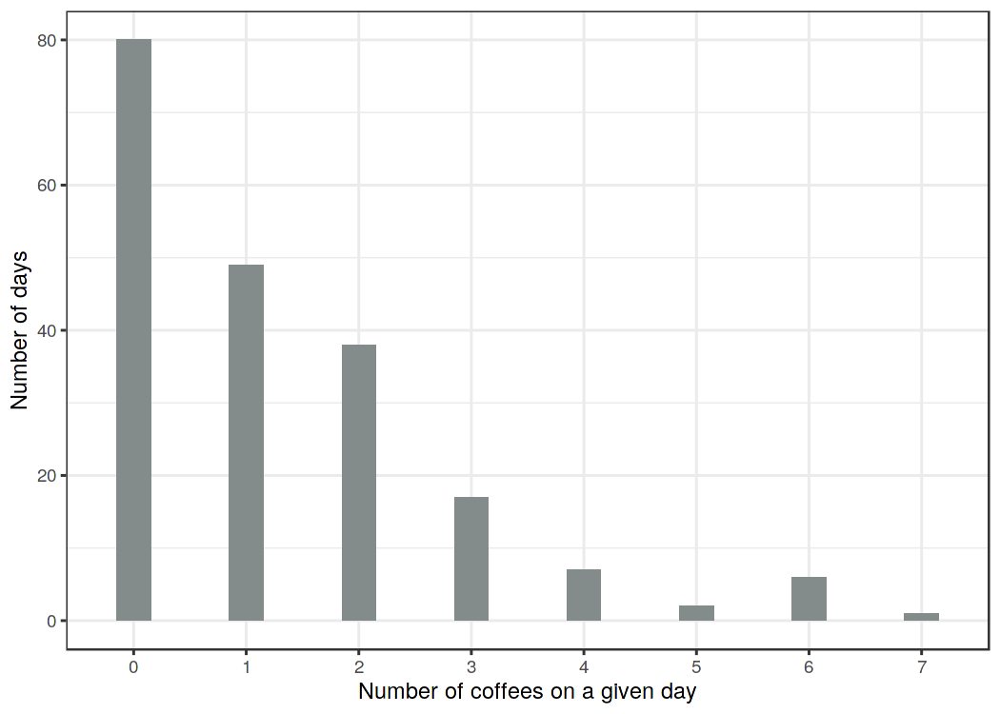
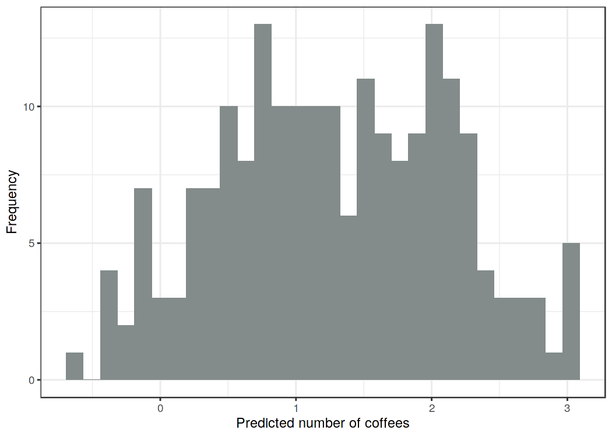
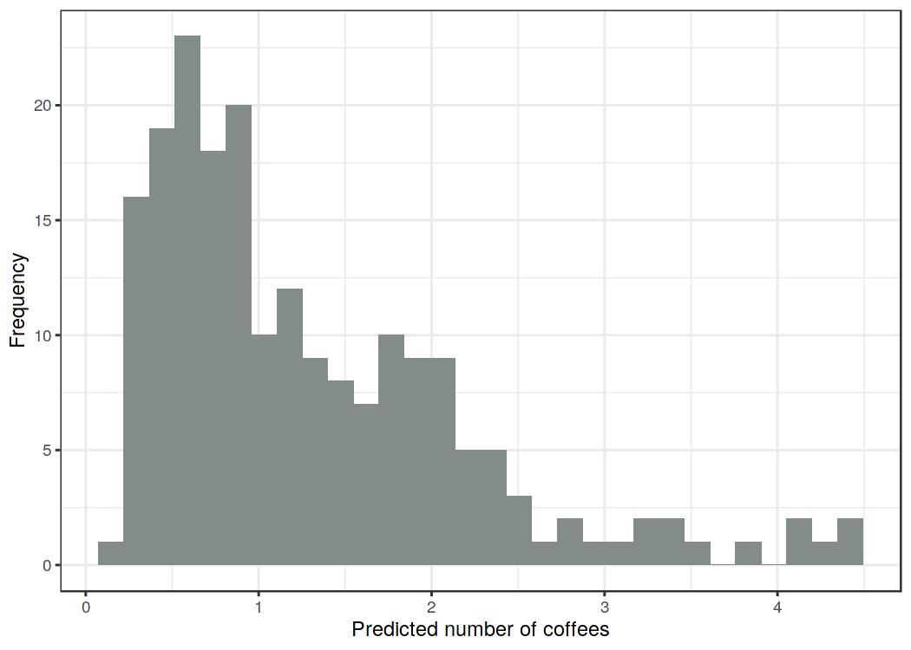
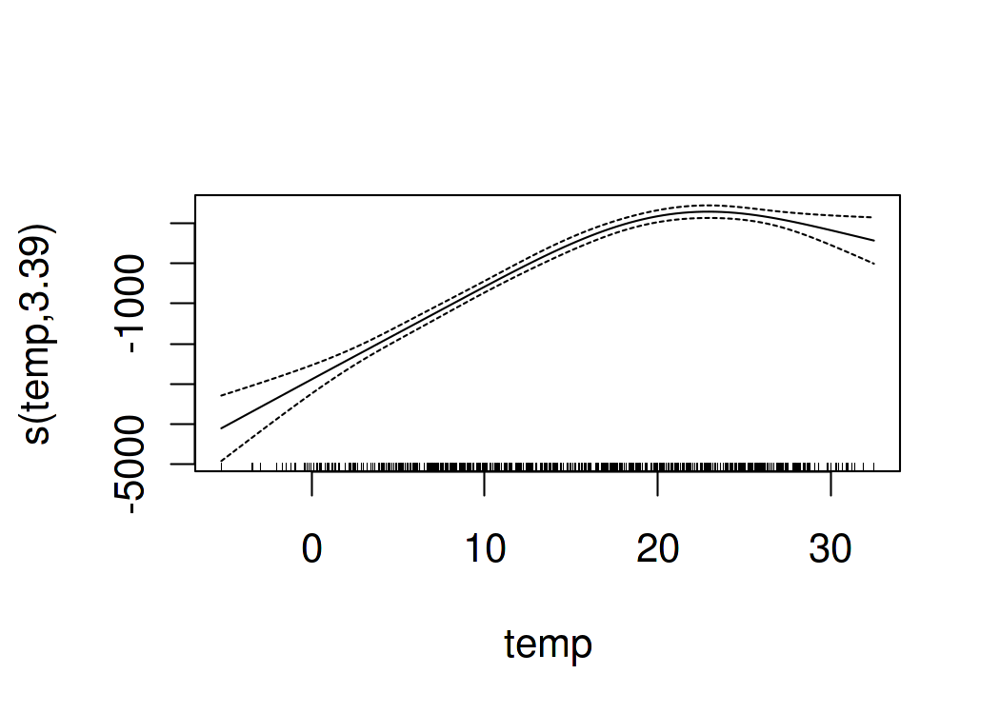

## Linear Model 2.0 - GLMs, GAMs and more {#extend-lm}

The biggest strength but also the biggest weakness of the [linear regression model](#limo) is that the prediction is modeled as a weighted sum of the features.
In addition, the linear model comes with  many other assumptions.
The bad news is (well, not really news) that all those assumptions are often violated in reality: 
The outcome given the features might have a non-Gaussian distribution, the features might interact and the relationship between the features and the outcome might be nonlinear.
The good news is that the statistics community has developed a variety of modifications that transform the linear regression model from a simple blade into a Swiss knife.

This chapter is definitely not your definite guide to extending linear models. 
Rather, it serves as an overview of extensions such as Generalized Linear Models (GLMs) and Generative Additive Models (GAMs) and gives you a little intuition.
After reading, you should have a solid overview of how to extend linear models.
If you want to learn more about the linear regression model first, I suggest you read the [chapter on linear regression models](#limo), if you haven't already.

Let's remember the formula of a linear regression model:

{$$}y_{i}=\beta_{0}+\beta_{1}x_{i1}+\ldots+\beta_{p}x_{ip}+\epsilon_{i}{/$$}

The linear regression model assumes that the outcome y of the i-th instance can be expressed by a weighted sum of its p features {$$}x_{ij}{/$$} with an individual error {$$}\epsilon_i{/$$}, which is following a Gaussian distribution.
By forcing the data into this corset of a formula, we obtain a lot of model interpretability.
The feature effects are additive, meaning no interactions, and the relationship is linear, meaning an increase of a feature by one unit can be directly translated into an increase/decrease of the predicted outcome.
The linear model allows us to compress the relationship between a feature and the expected outcome into a single number, namely the estimated weight.

But a simple weighted sum is too restrictive for many real world prediction problems.
In this chapter we will learn about three problems of the classical linear regression model and how to solve them.
There are many more problems with possibly violated assumptions, but we will focus on the three shown in the following figure:

There is a solution to all these problems:

**Problem**: The target outcome y given the features doesn't follow a Gaussian distribution.  
**Example**: Suppose I want to train a model to predict how many minutes I will ride my bike on a given day.
As features I have the type of day, the weather and so on.
If I use a linear model, it could predict negative minutes because it assumes a Gaussian distribution which does not stop at 0 minutes.
Also if I want to predict probabilities with a linear model, I can get probabilities that are negative or greater than 1.  
**Solution**: [Generalized Linear Models (GLMs)](#glm)

**Problem**: The features interact.  
**Example**: On average, light rain has a slight negative effect on my desire to go cycling.
But in summer during rush hour I welcome rain, because then all these fair-weather cyclists stay at home and I have the bike paths for myself!
This is an interaction between time and weather that can't be captured by a purely additive model.  
**Solution**: [Adding interactions manually](#lm-interact)

**Problem**: The relationship between the features and y is not linear.  
**Example**: Between 0 and 25 degrees Celsius, the influence of the temperature on my desire to ride a bike could be linear, which means that an increase from 0 to 1 degree causes the same increase in cycling desire as an increase from 20 to 21. 
But at higher temperatures my motivation to cycle levels off and even decreases - I don't like to bike when it's too hot.  
**Solutions**: [Generalized Additive Models (GAMs); transformation of features](#gam)

The solutions to these three problems are presented in this chapter.
Many further extensions of the linear model are omitted.
If I attempted to cover everything here, the chapter would quickly turn into a book within a book about a topic that is already covered in many books.
But since you are already here, I have made a little problem plus solution overview for linear model extensions, which you can find at the [end of the chapter](#more-lm-extension).
The name of the solution is meant to serve as a starting point for a search.

### Non-Gaussian Outcomes - GLMs {#glm}

The linear regression model assumes that the outcome given the input features follows a Gaussian distribution.
This assumption excludes many cases:
The outcome can also be a category (cancer vs. healthy), a count (number of children), the time to the occurrence of an event (time to failure of a machine) or a very skewed outcome with a few very high values (household income).
The linear regression model can be extended to model all these types of outcomes.
This extension is called **Generalized Linear Models** or **GLMs** for short.
Throughout this chapter, I will use the name GLM for both the general framework and for particular models from that framework.
The core concept of any GLM is: 
Keep the weighted sum of the features, but allow non-Gaussian outcome distributions and connect the expected mean of this distribution and the weighted sum through a possibly nonlinear function.
For example, the logistic regression model assumes a Bernoulli distribution for the outcome and links the expected mean and the weighted sum using the logistic function.

The GLM mathematically links the weighted sum of the features with the mean value of the assumed distribution using the link function g, which can be chosen flexibly depending on the type of outcome. 

{$$}g(E_Y(y_i|x_i))=\beta_0+\beta_1{}x_{i1}+\ldots{}\beta_p{}x_{ip}{/$$}

GLMs consist of three components:
The link function g, the weighted sum {$$}\beta{}X{/$$} (sometimes called linear predictor) and a probability distribution from the exponential family that defines {$$}E_Y{/$$}.

The exponential family is a set of distributions that can be written with the same (parameterized) formula that includes an exponent, the mean and variance of the distribution and some other parameters.
I won't go into the mathematical details because this is a very big universe of its own that I don't want to enter.
Wikipedia has a neat [list of distributions from the exponential family](https://en.wikipedia.org/wiki/Exponential_family#Table_of_distributions). 
Any distribution from this list can be chosen for your GLM.
Based on the type of the outcome you want to predict, choose a suitable distribution.
The outcome is a count of something (e.g. number of children living in a household)?
Then the Poisson distribution could be a good choice.
The outcome is always positive (e.g. time between two events)?
Then the exponential distribution could be a good choice.

Let's consider the classic linear model as a special case of a GLM.
The link function for the Gaussian distribution in the classic linear model is simply the identity function.
The Gaussian distribution is parameterized by the mean {$$}\mu{/$$} and the variance {$$}\sigma^2{/$$}.
The mean describes the value that we expect on average and the variance describes how much the values vary around this mean.
In the linear model, the link function links the weighted sum of the features to the mean of the Gaussian distribution.

Under the GLM framework, this concept generalizes to any distribution (from the exponential family) and arbitrary link functions.
If y is a count of something, such as the number of coffees someone drinks on a certain day, we could model it with a GLM with a Poisson distribution and the natural logarithm as the link function:

{$$}ln(E_Y(y|x_i))=x_i\beta{/$$}

The logistic regression model is also a GLM that assumes a Bernoulli distribution and uses the logistic function as the link function.
The mean {$$}\mu{/$$} of the binomial distribution used in logistic regression is the probability that y is 1.

{$$}x_i\beta=ln\left(\frac{E_Y(y|x_i)}{1-E_Y(y|x_i)}\right)=ln\left(\frac{P(y=1|x_i)}{1-P(y=1|x_i)}\right){/$$}

And if we solve this equation to have P(Y=1) on one side, we get the logistic regression formula:

{$$}P(y_{i}=1)=\frac{1}{1+exp(-x_i\beta)}{/$$}

Each distribution from the exponential family has a canonical link function that can be derived mathematically from the distribution.
The GLM framework makes it possible to choose the link function independently of the distribution.
How to choose the right link function?
There is no perfect recipe. 
You take into account knowledge about the distribution of your target, but also theoretical considerations and how well the model fits your actual data.
For some distributions the canonical link function can lead to values that are invalid for that distribution.
In the case of the exponential distribution, the canonical link function is the negative inverse, which can lead to negative predictions outside the domain of the exponential distribution.
Since you can choose any link function, the simple solution is to choose another function that respects the domain of the distribution.

**Examples**

I have simulated a dataset on coffee drinking behavior to highlight the need for GLMs.
Suppose you have collected data about your daily coffee drinking behavior.
If you don't like coffee, pretend it's about tea.
Along with number of cups, you record your current stress level on a scale of 1 to 10, how well you slept the night before on a scale of 1 to 10 and whether you worked on that day.
The goal is to predict the number of coffees given the features stress, sleep and work.
I simulated data for 200 days.
Stress and sleep were drawn uniformly between 1 and 10 and work yes/no was drawn with a 50/50 chance (what a life!). 
For each day, the number of coffees was then drawn from a Poisson distribution, modelling the intensity {$$}\lambda{/$$} (which is also the expected value of the Poisson distribution) as a function of the features sleep, stress and work.
You can guess where this story will lead:
*"Hey, let's model this data with a linear model ... Oh it doesn't work ... Let's try a GLM with Poisson distribution ... SURPRISE! Now it works!".*
I hope I didn't spoil the story too much for you.

Let's look at the distribution of the target variable, the number of coffees on a given day:

On 80 of the 200 days you had no coffee at all and on the most extreme day you had 7.
Let's naively use a linear model to predict the number of coffees using sleep level, stress level and work yes/no as features.
What can go wrong when we falsely assume a Gaussian distribution?
A wrong assumption can invalidate the estimates, especially the confidence intervals of the weights. 
A more obvious problem is that the predictions don't match the "allowed" domain of the true outcome, as the following figure shows.

The linear model does not make sense, because it predicts negative number of coffees.
This problem can be solved with Generalized Linear Models (GLMs).
We can change the link function and the assumed distribution. 
One possibility is to keep the Gaussian distribution and use a link function that always leads to positive predictions such as the log-link (the inverse is the exp-function) instead of the identity function.
Even better: 
We choose a distribution that corresponds to the data generating process and an appropriate link function. 
Since the outcome is a count, the Poisson distribution is a natural choice, along with the logarithm as link function. 
In this case, the data was even generated with the Poisson distribution, so the Poisson GLM is the perfect choice.
The fitted Poisson GLM leads to the following distribution of predicted values:

No negative amounts of coffees, looks much better now.

**Interpretation of GLM weights**

The assumed distribution together with the link function determines how the estimated feature weights are interpreted.
In the coffee count example, I used a GLM with Poisson distribution and log link, which implies the following relationship between the features and the expected outcome.

{$$}ln(E(\text{coffees}|\text{stress},\text{sleep},\text{work}))=\beta_0+\beta_{\text{stress}}x_{\text{stress}}+\beta_{\text{sleep}}x_{\text{sleep}}+\beta_{\text{work}}x_{\text{work}}{/$$}

To interpret the weights we invert the link function so that we can interpret the effect of the features on the expected outcome and not on the logarithm of the expected outcome. 

{$$}E(\text{coffees}|\text{stress},\text{sleep},\text{work})=exp(\beta_0+\beta_{\text{stress}}x_{\text{stress}}+\beta_{\text{sleep}}x_{\text{sleep}}+\beta_{\text{work}}x_{\text{work}}){/$$}

Since all the weights are in the exponential function, the effect interpretation is not additive, but multiplicative, because exp(a + b) is exp(a) times exp(b).
The last ingredient for the interpretation are the actual weights of the toy example.
The following table lists the estimated weights and exp(weights) together with the 95% confidence interval:

|            | weight|exp(weight) [2.5%, 97.5%] |
|:-----------|------:|:-------------------------|
|(Intercept) |  -0.12|0.89 [0.56, 1.38]         |
|stress      |   0.11|1.11 [1.06, 1.17]         |
|sleep       |  -0.16|0.85 [0.81, 0.89]         |
|workYES     |   0.88|2.42 [1.87, 3.16]         |

Increasing the stress by one point multiplies the expected number of coffees by the factor 1.11. 
Increasing the sleep by one point multiplies the expected number of coffees by the factor 0.85.
The predicted number of coffees is on average 2.42 times the number of coffees on a non-working day compared to a working day.
In summary the more stress, the less sleep and the more work, the more coffee is consumed.

In this section you learned a little about Generalized Linear Models that are useful when the target does not follow a Gaussian distribution. 
Next, we look at how to integrate interactions between two features into the linear regression model.

### Interactions {#lm-interact}

The linear model assumes that the effect of one feature is the same regardless of the values of the other features (= no interactions).
But often there are interactions in the data.
To predict the [number of bicycles](#bike-data) rented, there may be an interaction between temperature and whether it's a working day or not.
Perhaps, when people have to work, the temperature doesn't influence the number of rented bikes much, because people will ride the rented bike to work no matter what happens.
On days off, many people ride for pleasure, but only when it's warm enough.
When it comes to rental bicycles, you might expect an interaction between temperature and working day.

How can we get the linear model to include interactions?
Before you fit the linear model, add a column to the feature matrix that represents the interaction between the features and fit the model as usual.
The solution is elegant in a way, since it doesn't require any change of the linear model, only additional columns in the data.
In the working day and temperature example, we would add a new feature that is zero for non-working days, otherwise the value of the temperature feature, assuming that working day is the reference category.
Suppose our data looks like this:

|work | temp|
|:----|----:|
|Y    |   25|
|N    |   12|
|N    |   30|
|Y    |    5|

The data matrix used by the linear model looks slightly different.
The following table shows what the data prepared for the model looks like if we don't specify any interactions.
Normally, this transformation is performed automatically by any statistical software.

| Intercept| workY| temp|
|---------:|-----:|----:|
|         1|     1|   25|
|         1|     0|   12|
|         1|     0|   30|
|         1|     1|    5|

The first column is the intercept term.
The second column encodes the categorical feature, with 0 for the reference category and 1 for the other.
The third column contains the temperature.

If we want the linear model to consider the interaction between temperature and the workingday feature, we have to add a column for the interaction:

| Intercept| workY| temp| workY.temp|
|---------:|-----:|----:|----------:|
|         1|     1|   25|         25|
|         1|     0|   12|          0|
|         1|     0|   30|          0|
|         1|     1|    5|          5|

The new column "workY.temp" captures the interaction between the features working day (work) and temperature (temp).
This new feature column is zero for an instance if the workingday feature is at the reference category ("N" for no working day), otherwise it assumes the value of the instances temperature feature.
With this type of encoding, the linear model can learn a different linear effect of temperature for both types of days.
This is the interaction effect between the two features.
Without an interaction term, the combined effect of a categorical and a numerical feature can be described by a line that is vertically shifted for the different categories.
If we include the interaction, we allow the effect of the numerical features (the slope) to have a different value in each category.

The interaction of two categorical features works similarly.
We create additional features which represent combinations of categories. 
So these artificial data containing working day (work) and a categorical weather feature (wthr): 

|work |wthr |
|:----|:----|
|Y    |Good |
|N    |Bad  |
|N    |Ok   |
|Y    |Good |

Becomes this: 

| Intercept| workY| wthrGood| wthrOk| workY.wthrGood| workY.wthrOk|
|---------:|-----:|--------:|------:|--------------:|------------:|
|         1|     1|        1|      0|              1|            0|
|         1|     0|        0|      0|              0|            0|
|         1|     0|        0|      1|              0|            0|
|         1|     1|        1|      0|              1|            0|

The first column again serves to estimate the intercept.
The second column is the coded first categorical feature.
Columns three and four are for the second categorical feature, which requires two columns because you need two weights to capture the effect for three categories, one of which is the reference category.
The rest of the columns capture the interactions.
For each category of both features (except for the reference categories), we create a new feature column that is 1 if both features have a certain category, otherwise 0.

For two numerical features, the interaction column is even easier to construct: 
We simply multiply both numerical features.

There are approaches to automatically detect and add interaction terms. 
One of them can be found in the [RuleFit chapter](#rulefit).
The RuleFit algorithm first mines interaction terms and then estimates a linear regression model including interactions.

**Example**

Let's return to the [bike rental prediction task](#bike-data) which we have already modeled in the [linear model chapter](#limo).
This time, we additionally consider an interaction between the temperature and the working day feature.
This results in the following estimated weights and confidence intervals.

|                           |  Weight| Std. Error|    2.5%|   97.5%|
|:--------------------------|-------:|----------:|-------:|-------:|
|(Intercept)                |  2185.8|      250.2|  1694.6|  2677.1|
|seasonSUMMER               |   893.8|      121.8|   654.7|  1132.9|
|seasonFALL                 |   137.1|      161.0|  -179.0|   453.2|
|seasonWINTER               |   426.5|      110.3|   209.9|   643.2|
|holidayHOLIDAY             |  -674.4|      202.5| -1071.9|  -276.9|
|workingdayWORKING DAY      |   451.9|      141.7|   173.7|   730.1|
|weathersitMISTY            |  -382.1|       87.2|  -553.3|  -211.0|
|weathersitRAIN/SNOW/STORM  | -1898.2|      222.7| -2335.4| -1461.0|
|temp                       |   125.4|        8.9|   108.0|   142.9|
|hum                        |   -17.5|        3.2|   -23.7|   -11.3|
|windspeed                  |   -42.1|        6.9|   -55.5|   -28.6|
|days_since_2011            |     4.9|        0.2|     4.6|     5.3|
|workingdayWORKING DAY:temp |   -21.8|        8.1|   -37.7|    -5.9|

The additional interaction effect is negative (-21.8) and differs significantly from zero, as shown by the 95% confidence interval, which does not include zero.
By the way, the data are not iid, because days that are close to each other are not independent from each other.
Confidence intervals might be misleading, just take it with a grain of salt.
The interaction term changes the interpretation of the weights of the involved features.
Does the temperature have a negative effect on a working day?
The answer is no, even if the table suggests it to an untrained user.
We can't interpret the "workingdayWORKING DAY:temp" interaction weight in isolation, since the interpretation would be:
"While leaving all other feature values unchanged, increasing the interaction effect of temperature for working day, decreases the predicted number of bikes."
But the interaction effect only adds to the main effect of the temperature.
Suppose it's a working day and we want to know what would happen if the temperature were 1 degree warmer today.
Then we need to sum both the weights for "temp" and "workindayWORKING DAY:temp" to determine how much the estimate increases.

It's easier to understand the interaction visually. 
By introducing an interaction term between a categorical and a numerical feature, we get two slopes for the temperature instead of one.
The temperature slope for days on which people don't have to work ('NO WORKING DAY') can be read directly from the table (125.4).
The temperature slope for days on which people have to work ('WORKING DAY') is the sum of both temperature weights (125.4  -21.8 = 103.6).
The intercept of the 'NO WORKING DAY'-line at temperature = 0 is determined by the intercept term of the linear model (2185.8).
The intercept of the 'WORKING DAY'-line at temperature = 0 is determined by the intercept term + the effect of working day (2185.8 + 451.9 = 2637.7).

### Nonlinear Effects - GAMs {#gam}

**The world is not linear.**
Linearity in linear models means that no matter what value an instance has in a particular feature, increasing the value by one unit always has the same effect on the predicted outcome.
Is it reasonable to assume that increasing the temperature by one degree at 10 degrees C  has the same effect on the number of rental bikes as increasing the temperature when it already has 40 degrees?
Intuitively one expects that increasing the temperature from 10 to 11 degrees Celsius has a positive effect and from 40 to 41 a negative effect, which is also the case, as you will see in many examples throughout the book.
The temperature feature has a linear, positive effect on the number of rental bikes, but at some point it flattens out and even has a negative effect at high temperatures.
The linear model doesn't care, it will dutifully find the best linear plane (by minimizing the Euclidean distance).

You can model nonlinear relationships using one of the following techniques:

- Simple transformation of the feature (e.g. logarithm)
- Categorization of the feature
- Generalized Additive Models (GAMs) that use regression splines

Before I go into the details of each method, let's start with an example that illustrates all three.
I took the [bike rental dataset](#bike-data) and trained a linear model with only the temperature feature to predict the number of rental bikes.
The following figure shows the estimated slope with: the standard linear model, a linear model with a transformed temperature feature (logarithm), a linear model with temperature treated as categorical feature and using regression splines (GAM).

![Predicting the number of rented bicycles using only the temperature feature. The use a linear model (top left) doesn't capture the flattening of the temperature effect at high temperatures suggested by the data and overestimates the number of bikes at low temperatures. One solution is to transform the feature with e.g. the logarithm (top right), categorize it (bottom left), which is usually a bad decision or use Generalized Additive Models that can automatically fit a smooth curve for temperature (bottom right). GAMs are often the best solution.](images/nonlinear-effects-1.png)

**Feature transformation**

Often the logarithm of the feature is used as a transformation.
Using the logarithm indicates that every 10-fold temperature increase has the same linear effect on the number of bikes, so changing from 1 degree Celsius to 10 degrees Celsius has the same effect as changing from 0.1 to 1 (sounds wrong).
Other examples for feature transformations are the square root, the square function and the exponential function.
Using a feature transformation means that you replace the column of this feature in the data with a function of the feature, such as the logarithm and fit the linear model as usual.
Some statistical programs also allow you to specify transformations in the call of the linear model.
You can be creative when you transform the feature.
The interpretation of the feature changes according to the selected transformation. 
If you use a log transformation, the interpretation in a linear model becomes:
"If the logarithm of the feature is increased by one, the prediction is increased by the corresponding weight."
When you use a GLM with a link function that is not the identity function, then the interpretation gets more complicated, because you have to incorporate both transformations into the interpretation (except when they cancel each other out, like log and exp, then the interpretation gets easier).

**Feature categorization**

Another possibility to achieve a nonlinear effect is to discretize the feature; turn it into a categorical feature.
For example, you could cut the temperature feature into 20 intervals with the levels [-10, -5), [-5, 0), ... and so on.
When you use the categorized temperature instead of the continuous temperature, the linear model would estimate a step function because each level gets its own estimate.
The problem with this approach is that it needs more data, it's more likely to overfit and it's unclear how to discretize the feature meaningfully (equidistant intervals or quantiles? how many intervals?).
I would only use discretization if there is a very strong case for it.
For example, to make the model comparable to another study.

**Generalized Additive Models (GAMs)**

Why not 'simply' allow the (generalized) linear model to learn nonlinear relationships?
That's the motivation behind GAMs. 
GAMs relax the restriction that the relationship must be a simple weighted sum, and instead assume that the outcome can be modeled by  a sum of arbitrary functions of each feature.
Mathematically, the relationship looks like this:

{$$}g(E_Y(y_i|x_i))=\beta_0+f_1(x_{i1})+f_2(x_{i2})+\ldots+f_p(x_{ip}){/$$}

The formula is similar to the GLM formula with the difference that the linear term {$$}\beta_j{}x_{ij}{/$$} is replaced by a more flexible function {$$}f_j(x_{xij}){/$$}.
The core of a GAM is still a sum of feature effects, but you have the option to allow nonlinear relationships between some features and the output.
Linear effects are also covered by the framework, because for features to be handled linearly, you can limit their {$$}f_j(x_{ij}){/$$} only to take the form of {$$}x_{ij}\beta_j{/$$}.

The big question is how to learn nonlinear functions of some features.
The answer is called "splines" or "spline functions".
Splines are functions that can combined to approximate arbitrary functions.
A bit like stacking Lego bricks to build something more complex.
There is a confusing number of ways to define these spline functions.
If you are interested in learning more about all the ways to define splines, I wish you good luck on your journey.
I'm not going to go into details here, I'm just going to build an intuition.
What personally helped me the most for understanding splines was to visualize the individual spline functions and to look into how the data matrix is modified.
For example, to model the temperature with splines, we remove the temperature feature from the data and replace it with, say, 4 columns, each representing a spline function.
Usually you would have more spline functions, I only reduced the number for illustration purposes.
The value for each instance of these new spline features depends on their temperature value.
Together with all linear effects, the GAM then also estimates these spline weights.
GAMs also introduce a penalty term for the weights to keep them close to zero. 
This effectively reduces the flexibility of the splines and reduces overfitting. 
A smoothness parameter that is commonly used to control the flexibility of the curve is then tuned via cross-validation.
Ignoring the penalty term, nonlinear modeling with splines is fancy feature engineering.

In the example where we are predicting the number of bicycles with a GAM using only the temperature, the model feature matrix looks like this:

| (Intercept)| s(temp).1| s(temp).2| s(temp).3| s(temp).4|
|-----------:|---------:|---------:|---------:|---------:|
|           1|      0.93|     -0.14|      0.21|     -0.83|
|           1|      0.83|     -0.27|      0.27|     -0.72|
|           1|      1.32|      0.71|     -0.39|     -1.63|
|           1|      1.32|      0.70|     -0.38|     -1.61|
|           1|      1.29|      0.58|     -0.26|     -1.47|
|           1|      1.32|      0.68|     -0.36|     -1.59|

Each row represents an individual instance from the data (one day).
Each spline column contains the value of the spline function at the particular temperature values. 
The following graphic shows how these spline functions look like:

The GAM assigns weights to each temperature spline feature:

|            |  weight|
|:-----------|-------:|
|(Intercept) | 4504.35|
|s(temp).1   | -989.34|
|s(temp).2   |  740.08|
|s(temp).3   | 2309.84|
|s(temp).4   |  558.27|

And the actual curve, which results from the sum of the spline function weighted by the estimated weights, looks like this:

The interpretation of smooth effects requires a visual check of the fitted curve.
Splines are usually centered around the mean prediction, so a point on the curve is the difference to the mean prediction.
For example, at 0 degrees Celsius, the predicted number of bicycles is 3000 lower than the average prediction.

### Advantages

- All these extensions of the linear model are a bit of a universe in themselves. 
Whatever problems you face with linear models, **you will probably find an extension that fixes it**.
- Most methods have been used for decades, for example GAMs are almost 30 years old. 
The linear model and its extensions have established themselves as the status quo for data modeling in many research areas. 
For this reason, many researchers and practitioners from industry are very **experienced** with linear models and the methods are **accepted in many communities as status quo for modeling** .
- In addition to making predictions, you can use the models to **do inference**, draw conclusions about the data - given all the assumptions are not violated.
You get confidence intervals for weights, significance tests, prediction intervals and much more. 
- Statistical software usually has really good interfaces to fit GLMs, GAMs and more special linear models.
- The opacity of many machine learning models comes from 1) a lack of sparseness, which means that many features are used, 2) features that are treated in a nonlinear fashion, which means you need more than a single weight to describe the effect and 3) the modeling of interactions between the features.
Assuming that linear models are highly interpretable but often underfit reality, the extensions described in this chapter offer a good way to achieve a **smooth transition to more flexible models**, while preserving some of the interpretability.

### Disadvantages

- As advantage I have said that linear models live in their own universe.
The sheer **number of ways you can extend the simple linear model is overwhelming**, not just for beginners.
Actually, there are multiple parallel universes, because many communities of researchers and practitioners have their own names for methods that do more or less the same thing, which can be very confusing.
- Most modifications of the linear model make the model **less interpretable**.
Any link function (in a GLM) that is not the identity function complicates the interpretation;
Interactions complicate the interpretation of the weights;
Nonlinear feature effects are either less intuitive (like the log transformation) or can no longer be summarized by a single number (e.g. spline functions).
- GLMs, GAMs and so on **rely on assumptions** about the data generating process.
If those are violated, the interpretation of the weights is no longer valid.
- The performance of tree-based ensembles like the random forest or gradient tree boosting is in many cases better than the most sophisticated linear models.
This is partly my own experience and partly observations from the winning models on platforms like kaggle.com.

### Software

All examples in this chapter were created using the R language.
For GAMs, the `gam` package was used, but there are many others.
R has an incredible number of packages to extend linear regression models.
Unsurpassed by any other analytics language, R is home to every conceivable extension of the linear regression model extension.
You will find implementations of e.g. GAMs in Python (such as [pyGAM](https://github.com/dswah/pyGAM)), but theses implementation are not as mature.

### Further extensions {#more-lm-extension}

As promised, here is a list of modeling problems you encounter with linear models, along with the name of a solution for this problem that you can copy and paste into your favorite search engine.

- My data violates the assumption of being independent and identically distributed (iid).  
For example, repeated measurements on the same patient.  
Search for **mixed models** or **generalized estimating equations**.
- My model has heteroscedastic errors.  
For example, when predicting the value of a house, the model errors are usually higher in expensive houses, which violates the homoscedasticity of the linear model.  
Search for: **robust regression**.
- I have outliers that strongly influence my model.  
Search for **robust regression**.
- I want to predict the time until an event occurs.  
Time-to-event data usually comes with censored measurements, which means that for some instances there wasn't enough time to observe the event.
For example, a company wants to predict the failure of its ice machines, but only has data for two years.
Some machines are still intact after two years, but might fail later.  
Search for **parametric survival models**, **cox regression**, **survival analysis**.
- My outcome to predict is a category.   
If the outcome has two categories use a [logistic regression model](#logistic), that models the probability for the categories.  
If you have more categories, search for **multinomial regression**.  
Logistic regression and multinomial regression are both GLMs.
- I want to predict ordered categories.  
For example school grades.  
Search for **proportional odds model**.
- My outcome is a count (like number of children in a family).  
Search for **poisson regression**.  
The Poisson model is also a GLM.
Also you might have the problem that the count value of 0 is very frequent.  
Search for **zero-inflated Poisson regression**, **hurdle model**.
- I am not sure what features need to be included in the model to draw correct causal conclusions.  
For example, I want to know the effect of a drug on the blood pressure.
The drug has a direct effect on some blood value and this blood value affects the outcome. 
Should I include the blood value into the regression model?  
Search for **causal inference**, **mediation analysis**.
- I have missing data.  
Search for  **multiple imputation**.
- I want to integrate prior knowledge into my models.  
Search for: **Bayesian inference**.
- I am feeling a bit down lately.  
Search for **"Amazon Alexa Gone Wild!!! Full version from beginning to end"**
