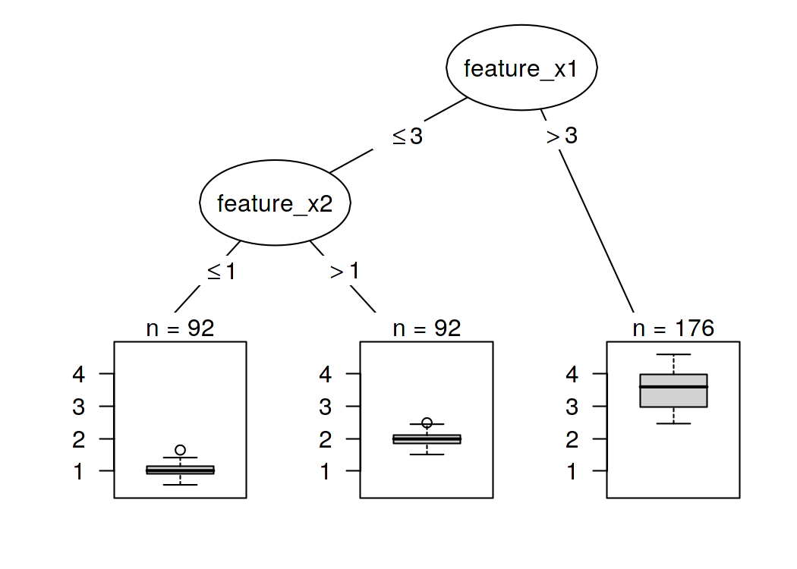
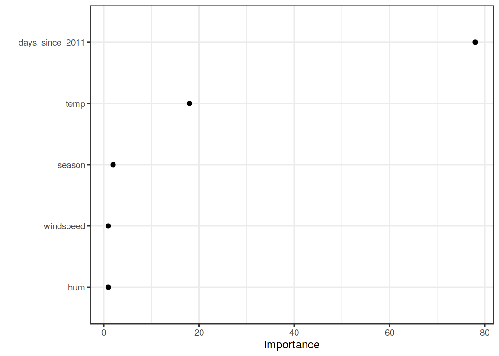

## Decision Tree {#tree}

Linear regression and logistic regression models fail in situations where the relationship between features and outcome is nonlinear or where features interact with each other.
Time to shine for the decision tree!
Tree based models split the data multiple times according to certain cutoff values in the features.
Through splitting, different subsets of the dataset are created, with each instance belonging to one subset.
The final subsets are called terminal or leaf nodes and the intermediate subsets are called internal nodes or split nodes.
To predict the outcome in each leaf node, the average outcome of the training data in this node is used.
Trees can be used for classification and regression.

There are various algorithms that can grow a tree.
They differ in the possible structure of the tree (e.g. number of splits per node), the criteria how to find the splits, when to stop splitting and how to estimate the simple models within the leaf nodes.
The classification and regression trees (CART) algorithm is probably the most popular algorithms for tree induction.
We will focus on CART, but the interpretation is similar for most other tree types.
I recommend the book 'The elements of statistical learning' (Hastie, Tibshirani, and Friedman 2009)[^Hastie] for a more detailed introduction to CART.

The following formula describes the relationship between the outcome y and features x.

{$$}\hat{y}_i=\hat{f}(x_i)=\sum_{m=1}^Mc_m{}I\{x_i\in{}R_m\}{/$$}

Each instance {$$}x_i{/$$} falls into exactly one leaf node (=subset {$$}R_m{/$$}).
{$$}I_{\{x_i\in{}R_m\}}{/$$} is the identity function that returns 1 if {$$}x_i{/$$} is in the subset {$$}R_m{/$$} and 0 otherwise.
If {$$}x_i{/$$} falls into a leaf node {$$}R_l{/$$}, the predicted outcome is {$$}\hat{y}=c_l{/$$}, where {$$}c_l{/$$} is the average of all training instances in leaf node {$$}R_l{/$$}.

But where do the subsets come from?
This is quite simple:
The algorithm takes a feature and determines which cut-off point minimizes the variance of y for a regression task or the Gini index of the class distribution of y for classification tasks.
The variance tells us how much the y values in a node are spread around their mean value.
The Gini index tells us how "impure" a node is, e.g. if all classes have the same frequency, the node is impure, if only one class is present, it is maximally pure.
Variance and Gini index are minimized when the data points in the nodes have very similar values for y.
As a consequence, the best cut-off point makes the two resulting subsets as different as possible with respect to the target outcome.
For categorical features, the algorithm tries to create subsets by trying different groupings of categories.
After the best cutoff per feature has been determined, the algorithm selects the feature for splitting that would result in the best partition in terms of the variance or Gini index and adds this split to the tree.
The algorithm continues this search-and-split recursively in both new nodes until a stop criterion is reached.
Possible criteria are:
A minimum number of instances that have to be in a node before the split, or the minimum number of instances that have to be in a terminal node.

### Interpretation
The interpretation is simple:
Starting from the root node you go to the next nodes and the edges tell you which subsets you are looking at.
Once you reach the leaf node, the node tells you the predicted outcome.
All the edges are connected by 'AND'.

Template: If feature x is [smaller/bigger] than threshold c AND ... then the predicted outcome is {$$}\hat{y}_{\text{leafnode}}{/$$}.

**Feature Importance**

The overall importance of a feature in a decision tree can be computed in the following way:
Go through all the splits for which the feature was used and measure how much it has reduced the variance or Gini index compared to the parent node.
The sum of all importances is scaled to 100.
This means that each importance can be interpreted as share of the overall model importance.

**Tree Decomposition**

Individual predictions of a decision tree can be explained by decomposing the decision path by feature.
We can track a decision through the tree and explain a prediction by the contributions  added at each decision node.

The root node in a decision tree is our starting point.
If we were to use the root node to make predictions, it would predict the mean of the outcome of the training data.
With the next split, we either subtract or add a term to this sum, depending on the next node in the path.
To get to the final prediction, we have to follow the path of the data instance that we want to explain and keep adding to the formula.

{$$}\hat{f}(x^{(i)})=\bar{y}+\sum_{d=1}^D\text{split.contrib(d,x)}=\bar{y}+\sum_{j=1}^p\text{feat.contrib(j,x)}{/$$}

The prediction of an individual instance is the mean of the target outcome plus the sum of all contributions of the splits that occur between the root node and the terminal node where the instance ends up.
We are not interested in the split contributions though, but in the feature contributions.
A feature might be used for more than one split or not at all.
We can add the contributions for each of the p features and get an interpretation of how much each feature has contributed to a prediction.

### Example
Let us have another look at the [bike rental data](#bike-data).
We want to predict the number of rented bikes on a certain day with a decision tree.
The learned tree looks like this:

The first split and one of the second splits were performed with the trend feature, which counts the days since  data collection began and covers the trend that the bike rental service has become more popular over time.
For days prior to the 105th day, the predicted number of bicycles is around 1800, between the 106th and 430th day it is around 3900.
For days after the 430th day, the prediction is either 4600 (if temperature is below 12 degrees) or 6600 (if temperature is above 12 degrees).

The feature importance tells us how much a feature helped to improve the purity of all nodes.
Here, the variance was used, since predicting bicycle rentals is a regression task.

The visualized tree shows that both temperature and time trend were used for splits, but does not quantify which feature was more important.
The feature importance measure shows that the time trend is far more important than temperature.

### Advantages

The tree structure is ideal for **capturing interactions** between features in the data.

The data also ends up in **distinct groups** that are often easier to understand than points on a multi-dimensional hyperplane as in linear regression.
The interpretation is arguably pretty simple.

The tree structure also has a **natural visualization**, with its nodes and edges.

Trees **create good explanations** as defined in the [chapter on "Human-friendly Explanations"](#good-explanation).
The tree structure automatically invites to think about predicted values for individual instances as counterfactuals:
"If feature {$$}x_j{/$$} had been greater / smaller than the split point, the prediction would have been {$$}\hat{y}_{1}{/$$} instead of {$$}\hat{y}_2{/$$}"
The tree explanations are contrastive, since you can always compare the prediction of an instance with relevant  "what-if"-scenarios (as defined by the tree) that are simply the other leaf nodes of the tree.
If the tree is short, like one to three splits deep, the resulting explanations are selective.
A tree with a depth of three requires a maximum of seven features and split points to create the explanation for predicting an instance.
The truthfulness of the prediction depends on the predictive performance of the tree.
The explanations for short trees are very simple and general, because for each split the instance falls into either one or the other leaf, and binary decisions are easy to understand.

There is no need to transform features. 
In linear models, it is sometimes necessary to take the logarithm of a feature. 
A decision tree works equally well with any monotonic transformation of a feature.

### Disadvantages

**Trees fail to deal with linear relationships**.
Any linear relationship between an input feature and the outcome has to be approximated by splits, creating a step function.
This is not efficient.

This goes hand in hand with **lack of smoothness**.
Slight changes in the input feature can have a big impact on the predicted outcome, which is usually not desirable.
Imagine a tree that predicts the value of a house and the tree uses the size of the house as one of the split feature.
The split occurs at 100.5 square meters.
Imagine a user of a house price estimator using your decision tree model:
She measures her house, comes to the conclusion that the house has 99 square meters, enters it into the price calculator and gets a prediction of 200 000 Euro.
The user notices that she has forgotten to measure a small storage room with 2 square meters.
The storage room has a sloping wall, so she is not sure whether she can count all of the area or only half of it.
So she decides to try both 100.0 and 101.0 square meters.
The results: The price calculator outputs 200 000 Euro and 205 000 Euro, which is rather unintuitive, because there was no change from 99 square meters to 100.

Trees are also quite **unstable**.
A few changes in the training dataset can create a completely different tree.
This is because each split depends on the parent split.
And if a different feature is selected as the first split feature, the entire tree structure changes.
It does not create confidence in the model if the structure changes so easily.

Decision trees are very interpretable - as long as they are short.
**The number of terminal nodes increases quickly with depth.**
The more terminal nodes and the deeper the tree, the more difficult it becomes to understand the decision rules of a tree.
A depth of 1 means 2 terminal nodes.
Depth of 2 means max. 4 nodes. 
Depth of 3 means max. 8 nodes.
The maximum number of terminal nodes in a tree is 2 to the power of the depth.

### Software

For the examples in this chapter, I used the `rpart` R package that implements CART (classification and regression trees).
CART is implemented in many programming languages, including [Python](https://scikit-learn.org/stable/modules/tree.html).
Arguably, CART is a pretty old and somewhat outdated algorithm and there are some interesting new algorithms for fitting trees.
You can find an overview of some R packages for decision trees in the [Machine Learning and Statistical Learning CRAN Task View](https://cran.r-project.org/web/views/MachineLearning.html) under the keyword "Recursive Partitioning".
