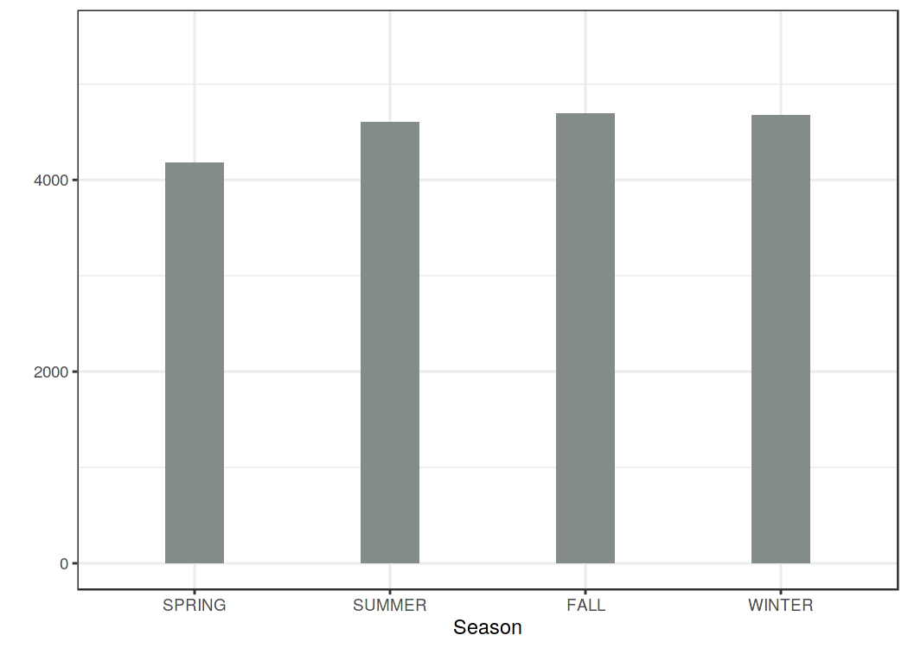

{pagebreak}

## Partial Dependence Plot (PDP) {#pdp}

The partial dependence plot (short PDP or PD plot) shows the marginal effect one or two features have on the predicted outcome of a machine learning model (J. H. Friedman 2001[^Friedman2001]). 
A partial dependence plot can show whether the relationship between the target and a feature is linear, monotonous or more complex.
For example, when applied to a linear regression model, partial dependence plots always show a linear relationship.

<!-- *Keywords: partial dependence plots, PDP, PD plot, marginal means, predictive margins, marginal effects* -->

The partial dependence function for regression is defined as:

{$$}\hat{f}_{x_S}(x_S)=E_{x_C}\left[\hat{f}(x_S,x_C)\right]=\int\hat{f}(x_S,x_C)d\mathbb{P}(x_C){/$$}

The x~S~ are the features for which the partial dependence function should be plotted and x~C~ are the other features used in the machine learning model {$$}\hat{f}{/$$}.
Usually, there are only one or two features in the set S.
The feature(s) in S are those for which we want to know the effect on the prediction.
The feature vectors x~S~ and x~C~ combined make up the total feature space x.
Partial dependence works by marginalizing the machine learning model output over the distribution of the features in set C, so that the function shows the relationship between the features x~S~ we are interested in and the predicted outcome.
By marginalizing over the other features, we get a function that depends only on features in S, interactions with other features included.

The partial function {$$}\hat{f}_{x_S}{/$$} is estimated by calculating averages in the training data, also known as Monte Carlo method:

{$$}\hat{f}_{x_S}(x_S)=\frac{1}{n}\sum_{i=1}^n\hat{f}(x_S,x^{(i)}_{C}){/$$}
The partial function tells us for a given value of x~S~ what the average marginal effect on the prediction is.
In this formula, {$$}x^{(i)}_{C}{/$$} are actual feature values from the dataset for the features in which we are not interested, and n is the number of instances in the dataset.
An assumption of the PDP is that the features in C are not correlated with the features in S. 
If this assumption is violated, the averages calculated for the partial dependence plot will include data points that are very unlikely or even impossible (see disadvantages).

For classification where the machine learning model outputs probabilities, the partial dependence plot displays the probability for a certain class given different values for feature(s) x~S~.
An easy way to deal with multiple classes is to draw one line or plot per class.

The partial dependence plot is a global method:
The method considers all instances and gives a statement about the global relationship of a feature with the predicted outcome.

**Categorical features**

So far, we have only considered numerical features.
For categorical features, the partial dependence is very easy to calculate.
For each of the categories, we get a PDP estimate by forcing all data instances to have the same category.
For example, if we look at the bike rental dataset and are interested in the partial dependence plot for the season,  we get 4 numbers, one for each season.
To compute the value for "summer", we replace the season of all data instances with "summer" and average the predictions.

### Examples

In practice, the set of features S usually only contains one feature or a maximum of two, because one feature produces 2D plots and two features produce 3D plots.
Everything beyond that is quite tricky.
Even 3D on a 2D paper or monitor is already challenging.

Let us return to the regression example, in which we predict the number of [bikes that will be rented on a given day](#bike-data).
First we fit a machine learning model, then we analyze the partial dependencies.
In this case, we have fitted a random forest to predict the number of bicycles and use the partial dependence plot to visualize the relationships the model has learned.
The influence of the weather features on the predicted bike counts is visualized in the following figure.

For warm but not too hot weather, the model predicts on average a high number of rented bicycles.
Potential bikers are increasingly inhibited in renting a bike when humidity exceeds 60%.
In addition, the more wind the fewer people like to cycle, which makes sense.
Interestingly, the predicted number of bike rentals does not fall when wind speed increases from 25 to 35 km/h, but there is not much training data, so the machine learning model could probably not learn a meaningful prediction for this range.
At least intuitively, I would expect the number of bicycles to decrease with increasing wind speed, especially when the wind speed is very high.

To illustrate a partial dependence plot with a categorical feature, we examine the effect of the season feature on the predicted bike rentals.

We also compute the partial dependence for [cervical cancer classification](#cervical).
This time we fit a random forest to predict whether a woman might get cervical cancer based on risk factors. 
We compute and visualize the partial dependence of the cancer probability on different features for the random forest:

We can also visualize the partial dependence of two features at once:

### Advantages 

The computation of partial dependence plots is **intuitive**: 
The partial dependence function at a particular feature value represents the average prediction if we force all data points to assume that feature value. 
In my experience, lay people usually understand the idea of PDPs quickly.

If the feature for which you computed the PDP is not correlated with the other features, then the PDPs perfectly represent how the feature influences the prediction on average.
In the uncorrelated case, the **interpretation is clear**: 
The partial dependence plot shows how the average prediction in your dataset changes when the j-th feature is changed. 
It is more complicated when features are correlated, see also disadvantages.

Partial dependence plots are **easy to implement**.

The calculation for the partial dependence plots has a **causal interpretation**. 
We intervene on a feature and measure the changes in the predictions. 
In doing so, we analyze the causal relationship between the feature and the prediction.[^pdpCausal]
The relationship is causal for the model -- because we explicitly model the outcome as a function of the features -- but not necessarily for the real world!

### Disadvantages

The realistic **maximum number of features** in a partial dependence function is two.
This is not the fault of PDPs, but of the 2-dimensional representation (paper or screen) and also of our inability to imagine more than 3 dimensions.

Some PD plots do not show the **feature distribution**. 
Omitting the distribution can be misleading, because you might overinterpret regions with almost no data.
This problem is easily solved by showing a rug (indicators for data points on the x-axis) or a histogram.

The **assumption of independence** is the biggest issue with PD plots. 
It is asumed that the feature(s) for which the partial dependence is computed are not correlated with other features.
For example, suppose you want to predict how fast a person walks, given the person's weight and height. 
For the partial dependence of one of the features, e.g. height, we assume that the other features (weight) are not correlated with height, which is obviously a false assumption. 
For the computation of the PDP at a certain height (e.g. 200 cm), we average over the marginal distribution of weight, which might include a weight below 50 kg, which is unrealistic for a 2 meter person. 
In other words:
When the features are correlated, we create new data points in areas of the feature distribution where the actual probability is very low (for example it is unlikely that someone is 2 meters tall but weighs less than 50 kg).
One solution to this problem is [Accumulated Local Effect plots](#ale) or short ALE plots that work with the conditional instead of the marginal distribution.

**Heterogeneous effects might be hidden** because PD plots only show the average marginal effects.
Suppose that for a feature half your data points have a positive assocation with the prediction -- the larger the feature value the larger the prediction -- and the other half has a negative assocation - the smaller the feature value the larger the prediction.
The PD curve could be a horizontal line, since the effects of both halves of the dataset could cancel each other out. 
You then conclude that the feature has no effect on the prediction. 
By plotting the [individiual conditional expectation curves](#ice) instead of the aggregated line, we can uncover heterogeneous effects.

### Software and Alternatives

There are a number of R packages that implement PDPs. 
I used the `iml` package for the examples, but there is also `pdp` or `DALEX`.
In Python you can use `Skater`.

Alternatives to PDPs presented in this book are [ALE plots](#ale) and [ICE curves](#ice).

[^Friedman2001]: Friedman, Jerome H. "Greedy function approximation: a gradient boosting machine." Annals of statistics (2001): 1189-1232.

[^pdpCausal]: Zhao, Qingyuan, and Trevor Hastie. "Causal interpretations of black-box models." Journal of Business & Economic Statistics, to appear. A DEPTH AND EXPOSURE TIME (2017).
