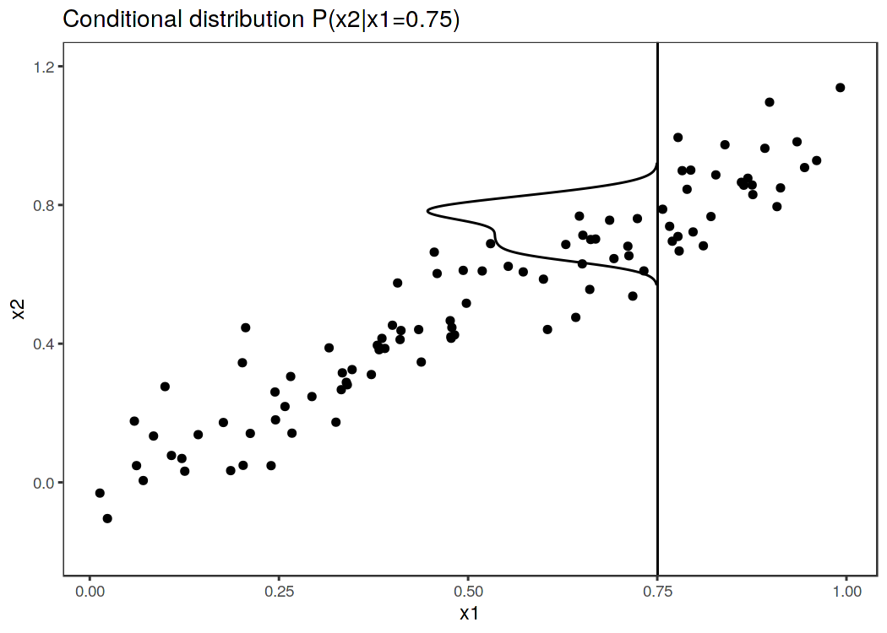
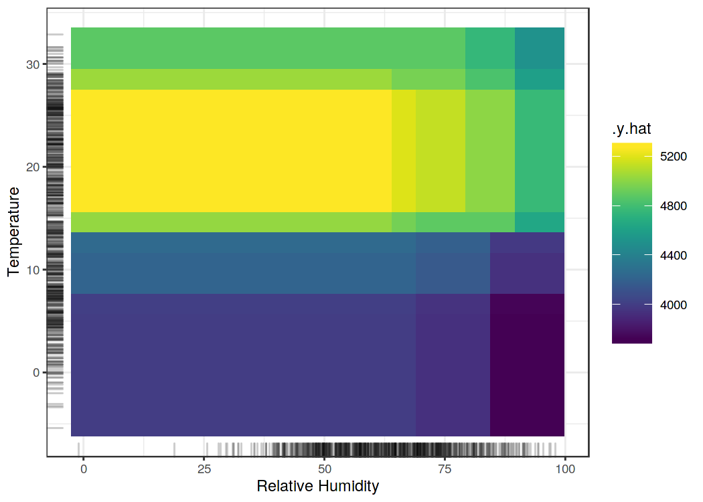

{pagebreak}

## Accumulated Local Effects (ALE) Plot {#ale}

Accumulated local effects[^ALE] describe how features influence the prediction of a machine learning model on average.
ALE plots are a faster and unbiased alternative to partial dependence plots (PDPs).

<!-- *Keywords: ALE plots, partial dependence plots, marginal means, predictive margins, marginal effects* -->

I recommend reading the [chapter on partial dependence plots](#pdp) first, as they are easier to understand and both methods share the same goal:
Both describe how a feature affects the prediction on average.
In the following section, I want to convince you that partial dependence plots have a serious problem when the features are correlated.

### Motivation and Intuition

If features of a machine learning model are correlated, the partial dependence plot cannot be trusted.
The computation of a partial dependence plot for a feature that is strongly correlated with other features involves averaging predictions of artificial data instances that are unlikely in reality.
This can greatly bias the estimated feature effect.
Imagine calculating partial dependence plots for a  machine learning model that predicts the value of a house depending on the number of rooms and the size of the living area.
We are interested in the effect of the living area on the predicted value.
As a reminder, the recipe for partial dependence plots is: 1) Select feature. 2) Define grid. 3) Per grid value: a) Replace feature with grid value and b) average predictions. 4) Draw curve.
For the calculation of the first grid value of the PDP -- say 30 m^2^ -- we replace the living area for **all** instances by 30 m^2^, even for houses with 10 rooms.
Sounds to me like a very unusual house.
The partial dependence plot includes these unrealistic houses in the feature effect estimation and pretends that everything is fine.
The following figure illustrates two correlated features and how it comes that the partial dependence plot method averages predictions of unlikely instances.

What can we do to get a feature effect estimate that respects the correlation of the features?
We could average over the conditional distribution of the feature, meaning at a grid value of x1, we average the predictions of instances with a similar x1 value.
The solution for calculating feature effects using the conditional distribution is called Marginal Plots, or M-Plots (confusing name, since they are based on the conditional, not the marginal distribution).
Wait, did I not promise you to talk about ALE plots?
M-Plots are not the solution we are looking for.
Why do M-Plots not solve our problem?
If we average the predictions of all houses of about 30 m^2^, we estimate the **combined** effect of living area and of number of rooms, because of their correlation.
Suppose that the living area has no effect on the predicted value of a house, only the number of rooms has.
The M-Plot would still show that the size of the living area increases the predicted value, since the number of rooms increases with the living area.
The following plot shows for two correlated features how M-Plots work.

M-Plots avoid averaging predictions of unlikely data instances, but they mix the effect of a feature with the effects of all correlated features.
ALE plots solve this problem by calculating -- also based on the conditional distribution of the features --  **differences in predictions instead of averages**.
For the effect of living area at 30 m^2^, the ALE method uses all houses with about 30 m^2^, gets the model predictions pretending these houses were 31 m^2^ minus the prediction pretending they were 29 m^2^.
This gives us the pure effect of the living area and is not mixing the effect with the effects of correlated features.
The use of differences blocks the effect of other features.
The following graphic provides intuition how ALE plots are calculated.

To summarize how each type of plot (PDP, M, ALE) calculates the effect of a feature at a certain grid value v:  
**Partial Dependence Plots**: "Let me show you what the model predicts on average when each data instance has the value v for that feature. 
I ignore whether the value v makes sense for all data instances."  
**M-Plots**: "Let me show you what the model predicts on average for data instances that have values close to v for that feature. 
The effect could be due to that feature, but also due to correlated features."  
**ALE plots**: "Let me show you how the model predictions change in a small "window" of the feature around v for data instances in that window."

### Theory

How do PD, M and ALE plots differ mathematically?
Common to all three methods is that they reduce the complex prediction function f to a function that depends on only one (or two) features.
All three methods reduce the function by averaging the effects of the other features, but they differ in whether averages of predictions or of **differences in predictions** are calculated and whether averaging is done over the marginal or conditional distribution.

Partial dependence plots average the predictions over the marginal distribution.

{$$}\begin{align*}\hat{f}_{x_S,PDP}(x_S)&=E_{X_C}\left[\hat{f}(x_S,X_C)\right]\\&=\int_{x_C}\hat{f}(x_S,x_C)\mathbb{P}(x_C)d{}x_C\end{align*}{/$$}

This is the value of the prediction function f, at feature value(s) {$$}x_S{/$$}, averaged over all features in {$$}x_C{/$$}.
Averaging means calculating the marginal expectation E over the features in set C, which is the integral over the predictions weighted by the probability distribution.
Sounds fancy, but to calculate the expected value over the marginal distribution, we simply take all our data instances, force them to have a certain grid value for the features in set S, and average the predictions for this manipulated dataset.
This procedure ensures that we average over the marginal distribution of the features.

M-plots average the predictions over the conditional distribution.

{$$}\begin{align*}\hat{f}_{x_S,M}(x_S)&=E_{X_C|X_S}\left[\hat{f}(X_S,X_C)|X_S=x_s\right]\\&=\int_{x_C}\hat{f}(x_S,x_C)\mathbb{P}(x_C|x_S)d{}x_C\end{align*}{/$$}

The only thing that changes compared to PDPs is that we average the predictions conditional on each grid value of the feature of interest, instead of assuming the marginal distribution at each grid value. 
In practice, this means that we have to define a neighborhood, for example for the calculation of the effect of 30 m^2^ on the predicted house value, we could average the predictions of all houses between 28 and 32 m^2^.

ALE plots average the changes in the predictions and accumulate them over the grid (more on the calculation later).

{$$}\begin{align*}\hat{f}_{x_S,ALE}(x_S)=&\int_{z_{0,1}}^{x_S}E_{X_C|X_S}\left[\hat{f}^S(X_s,X_c)|X_S=z_S\right]dz_S-\text{constant}\\=&\int_{z_{0,1}}^{x_S}\int_{x_C}\hat{f}^S(z_s,x_c)\mathbb{P}(x_C|z_S)d{}x_C{}dz_S-\text{constant}\end{align*}{/$$}

The formula reveals three differences to M-Plots. 
First, we average the changes of predictions, not the predictions itself.
The change is defined as the gradient (but later, for the actual computation, replaced by the differences in the predictions over an interval).

{$$}\hat{f}^S(x_s,x_c)=\frac{\delta\hat{f}(x_S,x_C)}{\delta{}x_S}{/$$}

The second difference is the additional integral over z.
We accumulate the local gradients over the range of features in set S, which gives us the effect of the feature on the prediction.
For the actual computation, the z's are replaced by a grid of intervals over which we compute the changes in the prediction.
Instead of directly averaging the predictions, the ALE method calculates the prediction differences conditional on features S and integrates the derivative over features S to estimate the effect.
Well, that sounds stupid. 
Derivation and integration usually cancel each other out, like first subtracting, then adding the same number. 
Why does it make sense here?
The derivative (or interval difference) isolates the effect of the feature of interest and blocks the effect of correlated features.

The third difference of ALE plots to M-plots is that we subtract a constant from the results.
This step centers the ALE plot so that the average effect over the data is zero.

One problem remains: 
Not all models come with a gradient, for example random forests have no gradient.
But as you will see, the actual computation works without gradients and uses intervals.
Let us delve a little deeper into the estimation of ALE plots.

### Estimation

First I will describe how ALE plots are estimated for a single numerical feature, later for two numerical features and for a single categorical feature.
To estimate local effects, we divide the feature into many intervals and compute the differences in the predictions.
This procedure approximates the gradients and also works for models without gradients.

First we estimate the uncentered effect: 

{$$}\hat{\tilde{f}}_{j,ALE}(x)=\sum_{k=1}^{k_j(x)}\frac{1}{n_j(k)}\sum_{i:x_{j}^{(i)}\in{}N_j(k)}\left[f(z_{k,j},x^{(i)}_{\setminus{}j})-f(z_{k-1,j},x^{(i)}_{\setminus{}j})\right]{/$$}

Let us break this formula down, starting from the right side. 
The name **Accumulated Local Effects** nicely reflects all the individual components of this formula.
At its core, the ALE method calculates the differences in predictions, whereby we replace the feature of interest with grid values z.
The difference in prediction is the **Effect** the feature has for an individual instance in a certain interval.
The sum on the right adds up the effects of all instances within an interval which appears in the formula as neighborhood {$$}N_j(k){/$$}.
We divide this sum by the number of instances in this interval to obtain the average difference of the predictions for this interval.
This average in the interval is covered by the term **Local** in the name ALE.
The left sum symbol means that we accumulate the average effects across all intervals.
The (uncentered) ALE of a feature value that lies, for example, in the third interval is the sum of the effects of the first, second and third intervals.
The word **Accumulated** in ALE reflects this.

This effect is centered so that the mean effect is zero.

{$$}\hat{f}_{j,ALE}(x)=\hat{\tilde{f}}_{j,ALE}(x)-\frac{1}{n}\sum_{i=1}^{n}\hat{\tilde{f}}_{j,ALE}(x^{(i)}_{j}){/$$}

The value of the ALE can be interpreted as the main effect of the feature at a certain  value compared to the average prediction of the data. 
For example, an ALE estimate of -2 at {$$}x_j=3{/$$} means that when the j-th feature has value 3, then the prediction is lower by 2 compared to the average prediction.

The quantiles of the distribution of the feature are used as the grid that defines the intervals.
Using the quantiles ensures that there is the same number of data instances in each of the intervals. 
Quantiles have the disadvantage that the intervals can have very different lengths.
This can lead to some weird ALE plots if the feature of interest is very skewed, for example many low values and only a few very high values.

**ALE plots for the interaction of two features**

ALE plots can also show the interaction effect of two features.
The calculation principles are the same as for a single feature, but we work with rectangular cells instead of intervals, because we have to accumulate the effects in two dimensions.
In addition to adjusting for the overall mean effect, we also adjust for the main effects of both features.
This means that ALE for two features estimate the second-order effect, which does not include the main effects of the features.
In other words, ALE for two features only shows the additional interaction effect of the two features.
I spare you the formulas for 2D ALE plots because they are long and unpleasant to read.
If you are interested in the calculation, I refer you to the paper, formulas (13) -- (16).
I will rely on visualizations to develop intuition about the second-order ALE calculation.

In the previous figure, many cells are empty due to the correlation.
In the ALE plot this can be visualized with a grayed out or darkened box. 
Alternatively, you can replace the missing ALE estimate of an empty cell with the ALE estimate of the nearest non-empty cell.

Since the ALE estimates for two features only show the second-order effect of the features, the interpretation requires special attention.
The second-order effect is the additional interaction effect of the features after we have accounted for the main effects of the features.
Suppose two features do not interact, but each has a linear effect on the predicted outcome. 
In the 1D ALE plot for each feature, we would see a straight line as the estimated ALE curve.
But when we plot the 2D ALE estimates, they should be close to zero, because the second-order effect is only the additional effect of the interaction.
ALE plots and PD plots differ in this regard:
PDPs always show the total effect, ALE plots show the first- or second-order effect.
These are design decisions that do not depend on the underlying math.
You can subtract the lower-order effects in a partial dependence plot to get the pure main or second-order effects or, you can get an estimate of the total ALE plots by refraining from subtracting the lower-order effects.

The accumulated local effects could also be calculated for arbitrarily higher orders (interactions of three or more features), but as argued in the [PDP chapter](#pdp), only up to two features makes sense, because higher interactions cannot be visualized or even interpreted meaningfully.

**ALE for categorical features**

The accumulated local effects method needs -- by definition -- the feature values to have an order, because the method accumulates effects in a certain direction.
Categorical features do not have any natural order.
To compute an ALE plot for a categorical feature we have to somehow create or find an order.
The order of the categories influences the calculation and interpretation of the accumulated local effects.

One solution is to order the categories according to their similarity based on the other features.
The distance between two categories is the sum over the distances of each feature.
The feature-wise distance compares either the cumulative distribution in both categories, also called Kolmogorov-Smirnov distance (for numerical features) or the relative frequency tables (for categorical features).
Once we have the distances between all categories, we use multi-dimensional scaling to reduce the distance matrix to a one-dimensional distance measure.
This gives us a similarity-based order of the categories.

To make this a little bit clearer, here is one example:
Let us assume we have the two categorical features "season" and "weather" and a numerical feature "temperature".
For the first categorical feature (season) we want to calculate the ALEs. 
The feature has the categories "spring", "summer", "fall", "winter".
We start to calculate the distance between categories "spring" and "summer". 
The distance is the sum of distances over the features temperature and weather.
For the temperature, we take all instances with season "spring", calculate the empirical cumulative distribution function and do the same for instances with season "summer" and measure their distance with the Kolmogorov-Smirnov statistic.
For the weather feature we calculate for all "spring" instances the probabilities for each weather type, do the same for the "summer" instances and sum up the absolute distances in the probability distribution.
If "spring" and "summer" have very different temperatures and weather, the total category-distance is large.
We repeat the procedure with the other seasonal pairs and reduce the resulting distance matrix to a single dimension by multi-dimensional scaling.

### Examples

Let us see ALE plots in action. 
I have constructed a scenario in which partial dependence plots fail.
The scenario consists of a prediction model and two strongly correlated features.
The prediction model is mostly a linear regression model, but does something weird at a combination of the two features for which we have never observed instances.

Is this a realistic, relevant scenario at all?
When you train a model, the learning algorithm minimizes the loss for the existing training data instances.
Weird stuff can happen outside the distribution of training data, because the model is not penalized for doing weird stuff in these areas.
Leaving the data distribution is called extrapolation, which can also be used to fool machine learning models, described in the [chapter on adversarial examples](#adversarial).
See in our little example how the partial dependence plots behave compared to ALE plots.

But is it not interesting to see that our model behaves oddly at x1 > 0.7 and x2 < 0.3?
Well, yes and no.
Since these are data instances that might be physically impossible or at least extremely unlikely, it is usually irrelevant to look into these instances.
But if you suspect that your test distribution might be slightly different and some instances are actually in that range, then it would be interesting to include this area in the calculation of feature effects. 
But it has to be a conscious decision to include areas where we have not observed data yet and it should not be a side-effect of the method of choice like PDP.
If you suspect that the model will later be used with differently distributed data, I recommend to use ALE plots and simulate the distribution of data you are expecting.

Turning to a real dataset, let us predict the [number of rented bikes](#bike-data) based on weather and day and check if the ALE plots really work as well as promised.
We train a regression tree to predict the number of rented bicycles on a given day and use ALE plots to analyze how temperature, relative humidity and wind speed influence the predictions.
Let us look at what the ALE plots say: 

Let us look at the correlation between temperature, humidity and wind speed and all other features.
Since the data also contains categorical features, we cannot only use the Pearson correlation coefficient, which only works if both features are numerical.
Instead, I train a linear model to predict, for example, temperature based on one of the other features as input.
Then I measure how much variance the other feature in the linear model explains and take the square root. 
If the other feature was numerical, then the result is equal to the absolute value of the standard Pearson correlation coefficient.
But this model-based approach of "variance-explained" (also called ANOVA, which stands for ANalysis Of VAriance) works even if the other feature is categorical. 
The "variance-explained" measure lies always between 0 (no association) and 1 (temperature can be perfectly predicted from the other feature).
We calculate the explained variance of temperature, humidity and wind speed with all the other features.
The higher the explained variance (correlation), the more (potential) problems with PD plots.
The following figure visualizes how strongly the weather features are correlated with other features.

This correlation analysis reveals that we may encounter problems with partial dependence plots, especially for the temperature feature.
Well, see for yourself:

Next, let us see ALE plots in action for a categorical feature.
The month is a categorical feature for which we want to analyze the effect on the predicted number of bikes.
Arguably, the months already have a certain order (January to December), but let us try to see what happens if we first reorder the categories by similarity and then compute the effects. 
The months are ordered by the similarity of days of each month based on the other features, such as temperature or whether it is a holiday.

Since many of the features are related to weather, the order of the months strongly reflects how similar the weather is between the months.
All colder months are on the left side (February to April) and the warmer months on the right side (October to August). 
Keep in mind that non-weather features have also been included in the similarity calculation, for example relative frequency of holidays has the same weight as the temperature for calculating the similarity between the months.

Next, we consider the second-order effect of humidity and temperature on the predicted number of bikes.
Remember that the second-order effect is the additional interaction effect of the two features and does not include the main effects. 
This means that, for example, you will not see the main effect that high humidity leads to a lower number of predicted bikes on average in the second-order ALE plot.

Keep in mind that both main effects of humidity and temperature say that the predicted number of bikes decreases in very hot and humid weather.
In hot and humid weather, the combined effect of temperature and humidity is therefore not the sum of the main effects, but larger than the sum.
To emphasize the difference between the pure second-order effect (the 2D ALE plot you just saw) and the total effect, let us look at the partial dependence plot.
The PDP shows the total effect, which combines the mean prediction, the two main effects and the second-order effect (the interaction).

If you are only interested in the interaction, you should look at the second-order effects, because the total effect mixes the main effects into the plot.
But if you want to know the combined effect of the features, you should look at the total effect (which the PDP shows).
For example, if you want to know the expected number of bikes at 30 degrees Celsius and 80 percent humidity, you can read it directly from the 2D PDP. 
If you want to read the same from the ALE plots, you need to look at three plots: 
The ALE plot for temperature, for humidity and for temperature + humidity and you also need to know the overall mean prediction.
In a scenario where two features have no interaction, the total effect plot of the two features could be misleading because it probably shows a complex landscape, suggesting some interaction, but it is simply the product of the two main effects.
The second-order effect would immediately show that there is no interaction.

Enough bicycles for now, let's turn to a classification task.
We train a random forest to predict the probability of [cervical cancer](#cervical) based on risk factors.
We visualize the accumulated local effects for two of the features:

Next, we look at the interaction between number of pregnancies and age.

![ALE plot of the 2nd-order effect of number of pregnancies and age. The interpretation of the plot is a bit inconclusive, showing what seems like overfitting. For example, the plot shows an odd model behavior at age of 18-20 and more than 3 pregnancies (up to 5 percentage point increase in cancer probability). There are not many women in the data with this constellation of age and number of pregnancies (actual data are displayed as points), so the model is not severely penalized during the training for making mistakes for those women.](images/ale-cervical-2d-1.png)

### Advantages

**ALE plots are unbiased**, which means they still work when features are correlated.
Partial dependence plots fail in this scenario because they marginalize over unlikely or even physically impossible combinations of feature values.

**ALE plots are faster to compute** than PDPs and scale with O(n), since the largest possible number of intervals is the number of instances with one interval per instance.
The PDP requires n times the number of grid points estimations. 
For 20 grid points, PDPs require 20 times more predictions than the worst case ALE plot where as many intervals as instances are used.

The **interpretation of ALE plots is clear**: Conditional on a given value, the relative effect of changing the feature on the prediction can be read from the ALE plot. 
**ALE plots are centered at zero**.
This makes their interpretation nice, because the value at each point of the ALE curve is the difference to the mean prediction.
**The 2D ALE plot only shows the interaction**: 
If two features do not interact, the plot shows nothing.

All in all, in most situations I would **prefer ALE plots over PDPs**, because features are usually correlated to some extent.

### Disadvantages

**ALE plots can become a bit shaky** (many small ups and downs) with a high number of intervals. 
In this case, reducing the number of intervals makes the estimates more stable, but also smoothes out and hides some of the true complexity of the prediction model.
There is **no perfect solution for setting the number of intervals**. 
If the number is too small, the ALE plots might not be very accurate. 
If the number is too high, the curve can become shaky.

Unlike PDPs, **ALE plots are not accompanied by ICE curves**.
For PDPs, ICE curves are great because they can reveal heterogeneity in the feature effect, which means that the effect of a feature looks different for subsets of the data.
For ALE plots you can only check per interval whether the effect is different between the instances, but each interval has different instances so it is not the same as ICE curves.

**Second-order ALE estimates have a varying stability across the feature space, which is not visualized in any way.** 
The reason for this is that each estimation of a local effect in a cell uses a different number of data instances.
As a result, all estimates have a different accuracy (but they are still the best possible estimates).
The problem exists in a less severe version for main effect ALE plots.
The number of instances is the same in all intervals, thanks to the use of quantiles as grid, but in some areas there will be many short intervals and the ALE curve will consist of many more estimates.
But for long intervals, which can make up a big part of the entire curve, there are comparatively fewer instances.
This happened in the cervical cancer prediction ALE plot for high age for example.

**Second-order effect plots can be a bit annoying to interpret**, as you always have to keep the main effects in mind.
It is tempting to read the heat maps as the total effect of the two features, but it is only the additional effect of the interaction.
The pure second-order effect is interesting for discovering and exploring interactions, but for interpreting what the effect looks like, I think it makes more sense to integrate the main effects into the plot.

The **implementation of ALE plots is much more complex** and less intuitive compared to partial dependence plots.

Even though ALE plots are not biased in case of correlated features, **interpretation remains difficult when features are strongly correlated**.
Because if they have a very strong correlation, it only makes sense to analyze the effect of changing both features together and not in isolation.
This disadvantage is not specific to ALE plots, but a general problem of strongly correlated features.

If the features are uncorrelated and computation time is not a problem, PDPs are slightly preferable because they are easier to understand and can be plotted along with ICE curves.

The list of disadvantages has become quite long, but do not be fooled by the number of words I use:
As a rule of thumb: Use ALE instead of PDP.

### Implementation and Alternatives

Did I mention that [partial dependence plots](#pdp) and [individual conditional expectation curves](#ice) are an alternative? =) 

To the best of my knowledge, ALE plots are currently only implemented in R, once in the [ALEPlot R package](https://cran.r-project.org/web/packages/ALEPlot/index.html) by the inventor himself and once in the [iml package](https://cran.r-project.org/web/packages/iml/index.html).

[^ALE]: Apley, Daniel W. "Visualizing the effects of predictor variables in black box supervised learning models." arXiv preprint arXiv:1612.08468 (2016).
