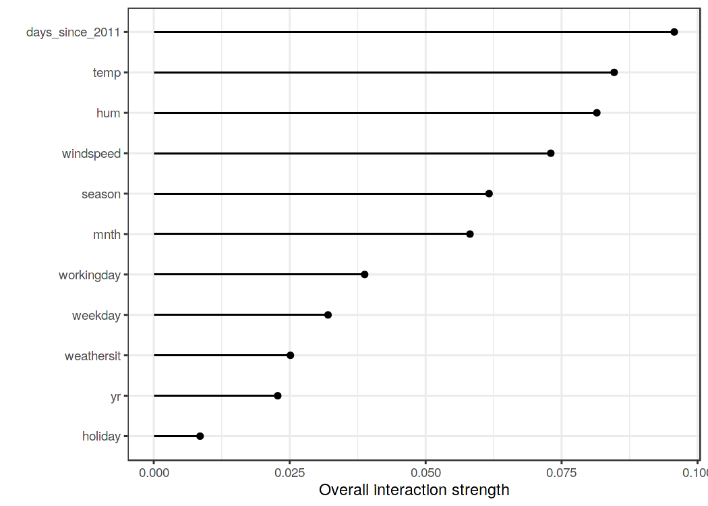
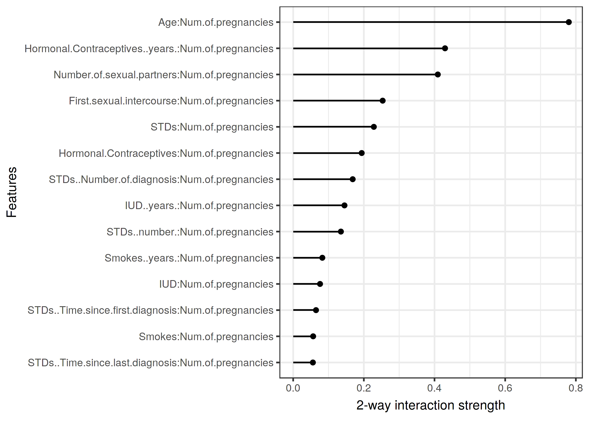

{pagebreak}

## Feature Interaction {#interaction}

When features interact with each other in a prediction model, the prediction cannot be expressed as the sum of the feature effects, because the effect of one feature depends on the value of the other feature.
Aristotle's predicate "The whole is greater than the sum of its parts" applies in the presence of interactions.

### Feature Interaction?

If a machine learning model makes a prediction based on two features, we can decompose the prediction into four terms: 
a constant term, a term for the first feature, a term for the second feature and a term for the interaction between the two features.  
The interaction between two features is the change in the prediction that occurs by varying the features after considering the individual feature effects.

For example, a model predicts the value of a house, using house size (big or small) and location (good or bad) as features, which yields four possible predictions:

| Location | Size  | Prediction |
|---------:|------:|----------------:|
| good     | big   | 300,000         | 
| good     | small | 200,000         |
| bad      | big   | 250,000         | 
| bad      | small | 150,000         |

We decompose the model prediction into the following parts: 
A constant term (150,000), an effect for the size feature (+100,000 if big; +0 if small) and an effect for the location (+50,000 if good; +0 if bad). 
This decomposition fully explains the model predictions.
There is no interaction effect, because the model prediction is a sum of the single feature effects for size and location. 
When you make a small house big, the prediction always increases by 100,000, regardless of location. 
Also, the difference in prediction between a good and a bad location is 50,000, regardless of size.

Let's now look at an example with interaction:

| Location | Size  | Prediction |
|---------:|------:|----------------:|
| good     | big   | 400,000         | 
| good     | small | 200,000         |
| bad      | big   | 250,000         | 
| bad      | small | 150,000         |

We decompose the prediction table into the following parts: 
A constant term (150,000), an effect for the size feature (+100,000 if big, +0 if small) and an effect for the location (+50,000 if good, +0 if bad). 
For this table we need an additional term for the interaction: +100,000 if the house is big and in a good location.
This is an interaction between size and location, because in this case the difference in prediction between a big and a small house depends on the location. 

One way to estimate the interaction strength is to measure how much of the variation of the prediction depends on the interaction of the features.
This measurement is called H-statistic, introduced by Friedman and Popescu (2008)[^Friedman2008].

### Theory: Friedman's H-statistic

We are going to deal with two cases:
First, a two-way interaction measure that tells us whether and to what extend two features in the model interact with each other;
Second, a total interaction measure that tells us whether and to what extend a feature interacts in the model with all the other features.
In theory, arbitrary interactions between any number of features can be measured, but these two are the most interesting cases.

If two features x~j~ and x~k~ do not interact, we can decompose the [partial dependence function](#pdp) as follows (assuming the partial dependence functions are centered at zero):

{$$}PD_{jk}(x_j,x_k)=PD_j(x_j)+PD_k(x_k){/$$}

where PD~jk~(x~j~,x~k~) is the 2-way partial dependence function of both features and PD~j~(x~j~) and PD~k~(x~k~) the partial dependence functions of the single features.

Likewise, if a feature has no interaction with any of the other features, we can express the prediction function {$$}\hat{f}(x){/$$} as a sum of partial dependence functions, where the first summand depends only on j and the second on all other features except j:

{$$}\hat{f}(x)=PD_j(x_j)+PD_{-j}(x_{-j}){/$$}

where PD~-j~(x~-j~) is the partial dependence function that depends on all features except x~j~.

This decomposition expresses the partial dependence (or full prediction) function without interactions (between features x~j~ and x~k~, or respectively x~j~ and all other features). 
In a next step, we measure the difference between the observed partial dependence function and the decomposed one without interactions.
We calculate the variance of the output of the partial dependence (to measure the interaction between two features) or of the entire function (to measure the interaction between a feature and all other features). 
The amount of the variance explained by the interaction (difference between observed and no-interaction PD) is used as interaction strength statistic.
The statistic is 0 if there is no interaction at all and 1 if all of the variance of the PD~jk~ or {$$}\hat{f}{/$$} is explained by the sum of the partial dependence functions.
An interaction statistic of 1 between two features means that each single PD function is constant and the effect on the prediction only comes through the interaction.

Mathematically, the H-statistic proposed by Friedman and Popescu for the interaction between feature x~j~ and x~k~ is:

{$$}H^2_{jk}=\sum_{i=1}^n\left[PD_{jk}(x_{j}^{(i)},x_k^{(i)})-PD_j(x_j^{(i)})-PD_k(x_{k}^{(i)})\right]^2/\sum_{i=1}^n{PD}^2_{jk}(x_j^{(i)},x_k^{(i)}){/$$}

The same applies to measuring whether a feature x~j~ interacts with any other feature:

{$$}H^2_{j}=\sum_{i=1}^n\left[\hat{f}(x^{(i)})-PD_j(x_j^{(i)})-PD_{-j}(x_{-j}^{(i)})\right]^2/\sum_{i=1}^n\hat{f}^2(x^{(i)}){/$$}

The H-statistic is expensive to evaluate, because it iterates over all data points and at each point the partial dependence has to be evaluated which in turn is done with all n data points. 
In the worst case, we need 2n^2^ calls to the machine learning models predict function to compute the two-way H-statistic (j vs. k) and 3n^2^ for the total H-statistic (j vs. all).
To speed up the computation, we can sample from the n data points . 
This has the disadvantage of increasing the variance of the partial dependence estimates, which makes the H-statistic unstable.
So if you are using sampling to reduce the computational burden, make sure to sample enough data points.

Friedman and Popescu also propose a test statistic to evaluate whether the H-statistic differs significantly from zero.
The null hypothesis is the absence of interaction. 
To generate the interaction statistic under the null hypothesis, you must be able to adjust the model so that it has no interaction between feature x~j~ and x~k~ or all others.
This is not possible for all types of models.
Therefore this test is model-specific, not model-agnostic, and as such not covered here.

The interaction strength statistic can also be applied in a classification setting if the prediction is a probability.

### Examples

Let us see what feature interactions look like in practice!
We measure the interaction strength of features in a support vector machine that predicts the number of [rented bikes](#bike-data) based on weather and calendrical features. 
The following plot shows the feature interaction H-statistic:

In the next example, we calculate the interaction statistic for a classification problem.
We analyze the interactions between features in a random forest trained to predict [cervical cancer](#cervical), given some risk factors.

After looking at the feature interactions of each feature with all other features, we can select one of the features and dive deeper into all the 2-way interactions between the selected feature and the other features.

### Advantages 

The interaction H-statistic has an **underlying theory** through the partial dependence decomposition.

The H-statistic has a **meaningful interpretation**:
The interaction is defined as the share of variance that is explained by the interaction.

Since the statistic is **dimensionless and always between 0 and 1**, it is comparable across features and even across models.

The statistic **detects all kinds of interactions**, regardless of their particular form.

With the H-statistic it is also possible to analyze arbitrary **higher interactions** such as the interaction strength between 3 or more features.

### Disadvantages

The first thing you will notice: 
The interaction H-statistic takes a long time to compute, because it is **computationally expensive**.

The computation involves estimating marginal distributions. 
These **estimates also have a certain variance** if we do not use all data points. 
This means that as we sample points, the estimates also vary from run to run and the **results can be unstable**.
I recommend repeating the H-statistic computation a few times to see if you have enough data to get a stable result.

It is unclear whether an interaction is significantly greater than 0. 
We would need to conduct a statistical test, but this **test is not (yet) available in a model-agnostic version**. 

Concerning the test problem, it is difficult to say when the H-statistic is large enough for us to consider an interaction "strong".

The H-statistic tells us the strength of interactions, but it does not tell us how the interactions look like.
That is what [partial dependence plots](#pdp) are for. 
A meaningful workflow is to measure the interaction strengths and then create 2D-partial dependence plots for the interactions you are interested in.

The H-statistic cannot be used meaningfully if the inputs are pixels.
So the technique is not useful for image classifier.

The interaction statistic works under the assumption that we can shuffle features independently.
If the features correlate strongly, the assumption is violated and **we integrate over feature combinations that are very unlikely in reality**.
That's the same problem that partial dependence plots have.
You can't say in general if it leads to overestimation or underestimation.

Sometimes the results are strange and for small simulations **do not yield the expected results**. 
But this is more of an anecdotal observation.

### Implementations

For the examples in this book, I used the R package `iml`, which is available on [CRAN](https://cran.r-project.org/web/packages/iml) and the development version on [Github](https://github.com/christophM/iml).
There are other implementations, which focus on specific models:
The R package [pre](https://cran.r-project.org/web/packages/pre/index.html) implements [RuleFit](#rulefit) and H-statistic.
The R package [gbm](https://github.com/gbm-developers/gbm3) implements gradient boosted models and H-statistic.

### Alternatives

The H-statistic is not the only way to measure interactions: 

Variable Interaction Networks (VIN) by Hooker (2004)[^Hooker2004] is an approach that decomposes the prediction function into main effects and feature interactions.
The interactions between features are then visualized as a network. 
Unfortunately no software is available yet.

Partial dependence based feature interaction by Greenwell et. al (2018)[^Greenwell2018] measures the interaction between two features.
This approach measures the feature importance (defined as the variance of the 1D partial dependence function) of one feature conditional on different, fixed points of the other feature. 
If the variance is high, then the features interact with each other, if it is zero, they do not interact.
The corresponding R package `vip` is available on [Github](https://github.com/koalaverse/vip).
The package also covers partial dependence plots and feature importance.

[^Hooker2004]: Hooker, Giles (2004). Discovering Additive Structure in Black Box Functions. Knowledge Discovery and Data Mining, 575–580. http://doi.org/10.1145/1014052.1014122

[^Greenwell2018]: Greenwell, Brandon. M., Boehmke, B. C., and McCarthy, A. J. (2018). A Simple and Effective Model-Based Variable Importance Measure, 1-27. Retrieved from http://arxiv.org/abs/1805.04755

