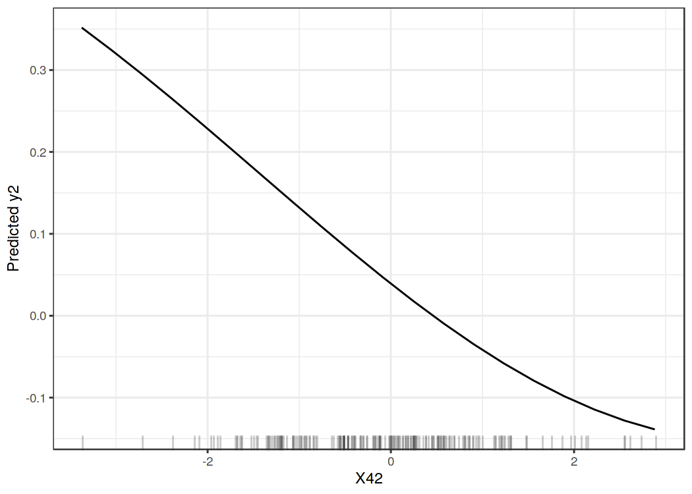
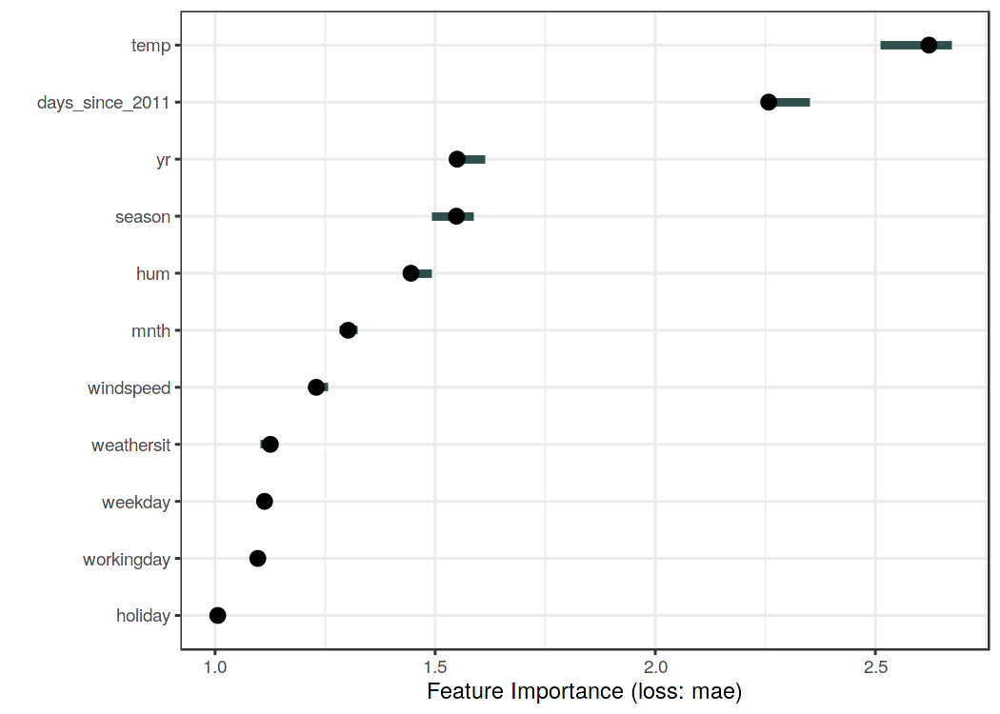

{pagebreak}

## Feature Importance {#feature-importance}

The importance of a feature is the increase in the prediction error of the model after we permuted the feature's values, which breaks the relationship between the feature and the true outcome. 

### Theory

The concept is really straightforward: 
We measure the importance of a feature by calculating the increase in the model's prediction error after permuting the feature.
A feature is "important" if shuffling its values increases the model error, because in this case the model relied on the feature for the prediction.
A feature is "unimportant" if shuffling its values leaves the model error unchanged, because in this case the model ignored the feature for the prediction.
The permutation feature importance measurement was introduced by Breiman (2001)[^Breiman2001] for random forests.
Based on this idea, Fisher, Rudin, and Dominici (2018)[^Fisher2018] proposed a model-agnostic version of the feature importance and called it model reliance. 
They also introduced more advanced ideas about feature importance, for example a (model-specific) version that takes into account that many prediction models may predict the data well.
Their paper is worth reading.

**The permutation feature importance algorithm based on Fisher, Rudin, and Dominici (2018):**

Input: Trained model f, feature matrix X, target vector y, error measure L(y,f).

1. Estimate the original model error e^orig^ = L(y, f(X))  (e.g. mean squared error)
2. For each feature j = 1,...,p do:
    - Generate feature matrix X^perm^ by permuting feature j in the data X. This breaks the association between feature j and true outcome y.
    - Estimate error e^perm^ = L(Y,f(X^perm^)) based on the predictions of the permuted data.
    - Calculate permutation feature importance FI^j^= e^perm^/e^orig^. Alternatively, the difference can be used: FI^j^ = e^perm^ - e^orig^
3. Sort features by descending FI.

Fisher, Rudin, and Dominici (2018) suggest in their paper to split the dataset in half and swap the values of feature j of the two halves instead of permuting feature j. 
This is exactly the same as permuting feature j, if you think about it. 
If you want a more accurate estimate, you can estimate the error of permuting feature j by pairing each instance with the value of feature j of each other instance (except with itself). 
This gives you a dataset of size `n(n-1)` to estimate the permutation error, and it takes a large amount of computation time. 
I can only recommend using the `n(n-1)` -method if you are serious about getting extremely accurate estimates.

### Should I Compute Importance on Training or Test Data? {#feature-importance-data}

*tl;dr: I do not have a definite answer.*  

Answering the question about training or test data touches the fundamental question of what feature importance is.
The best way to understand the difference between feature importance based on training vs. based on test data is an "extreme" example.
I trained a support vector machine to predict a continuous, random target outcome given 50 random features (200 instances).
By "random" I mean that the target outcome is independent of the 50 features.
This is like predicting tomorrow's temperature given the latest lottery numbers.
If the model "learns" any relationships, then it overfits.
And in fact, the SVM did overfit on the training data.
The mean absolute error (mae)for the training data is 0.29 and for the test data 0.82, which is also the error of the best possible model that always predicts the mean outcome of 0 (mae of  0.78).
In other words, the SVM model is garbage.
What values for the feature importance would you expect for the 50 features of this overfitted SVM?
Zero because none of the features contribute to improved performance on unseen test data?
Or should the importances reflect how much the model depends on each of the features, regardless whether the learned relationships generalize to unseen data?
Let us take a look at how the distributions of feature importances for training and test data differ.

It is unclear to me which of the two results is more desirable.
So I will try to make a case for both versions and let you decide for yourself.

**The Case for Test Data**

This is a simple case: 
Model error estimates based on training data are garbage -> feature importance relies on model error estimates -> feature importance based on training data is garbage.  
Really, it is one of the first things you learn in machine learning:
If you measure the model error (or performance) on the same data on which the model was trained, the measurement is usually too optimistic, which means that the model seems to work much better than it does in reality.
And since the permutation feature importance relies on measurements of the model error, we should use unseen test data.
The feature importance based on training data makes us mistakenly believe that feature are important for the predictions, when in reality the model was just overfitting and the features weren't important at all.

**The Case for Training Data**

The arguments for using training data are somewhat more difficult to formulate, but are IMHO just as compelling as the arguments for using test data.
We take another look at our garbage SVM.
Based on the training data, the most important feature was X20.
Let us look at a partial dependence plot of feature X20.
The partial dependence plot shows how the model output changes based on changes of the feature and does not rely on the generalization error.
It does not matter whether the PDP is computed with training or test data.

The plot clearly shows that the SVM has learned to rely on feature X20 for its predictions, but according to the feature importance based on the test data (1), it is not important.
Based on the training data, the importance is 1.18, reflecting that the model has learned to use this feature.
Feature importance based on the training data tells us which features are important for the model in the sense that it depends on them for making predictions.

As part of the case for using training data, I would like to introduce an argument against test data.
In practice, you want to use all your data to train your model to get the best possible model in the end.
This means no unused test data is left to compute the feature importance.
You have the same problem when you want to estimate the generalization error of your model.
If you would use (nested) cross-validation for the feature importance estimation, you would have the problem that the feature importance is not calculated on the final model with all the data, but on models with subsets of the data that might behave differently.

In the end, you need to decide whether you want to know how much the model relies on each feature for making predictions (-> training data) or how much the feature contributes to the performance of the model on unseen data (-> test data).
To the best of my knowledge, there is no research addressing the question of training vs. test data.
It will require more thorough examination than my "garbage-SVM" example.
We need more research and more experience with these tools to gain a better understanding.

Next, we will look at a some examples.
I based the importance computation on the training data, because I had to choose one and using the training data needed a few lines less code.

### Example and Interpretation

I show examples for classification and regression. 

**Cervical cancer (Classification)**

We fit a random forest model to predict [cervical cancer](#cervical).
We measure the error increase by 1-AUC (1 minus the area under the ROC curve).
Features associated with a model error increase by a factor of 1 (= no change) were not important for predicting cervical cancer.

The feature with the highest importance was Age associated with an error increase of 5.76 after permutation.

**Bike sharing (Regression)**

We fit a support vector machine model to predict [the number of rented bikes](#bike-data), given weather conditions and calendar information.
As error measurement we use the mean absolute error.

### Advantages

**Nice interpretation**: Feature importance is the increase in model error when the feature's information is destroyed.

Feature importance provides a **highly compressed, global insight** into the model's behavior. 

A positive aspect of using the error ratio instead of the error difference is that the feature importance measurements are **comparable across different problems**. 

The importance measure automatically **takes into account all interactions** with other features.
By permuting the feature you also destroy the interaction effects with other features. 
This means that the permutation feature importance takes into account both the  main feature effect and the interaction effects on model performance.
This is also a disadvantage because the importance of the interaction between two features is included in the importance measurements of both features.
This means that the feature importances do not add up to the total drop in performance, but the sum is larger.
Only if there is no interaction between the features, as in a linear model, the importances add up approximately.

Permutation feature importance **does not require retraining the model**.
Some other methods suggest deleting a feature, retraining the model and then comparing the model error.
Since the retraining of a machine learning model can take a long time, "only" permuting a feature can save a lot of time.
Importance methods that retrain the model with a subset of features appear intuitive at first glance, but the model with the reduced data is meaningless for the feature importance.
We are interested in the feature importance of a fixed model.
Retraining with a reduced dataset creates a different model than the one we are interested in.
Suppose you train a sparse linear model (with Lasso) with a fixed number of features with a non-zero weight.
The dataset has 100 features, you set the number of non-zero weights to 5.
You analyze the importance of one of the features that have a non-zero weight.
You remove the feature and retrain the model.
The model performance remains the same because another equally good feature gets a non-zero weight and your conclusion would be that the feature was not important.
Another example:
The model is a decision tree and we analyze the importance of the feature that was chose as the first split.
You remove the feature and retrain the model. 
Since another feature is chosen as the first split, the whole tree can be very different, which means that we compare the error rates of (potentially) completely different trees to decide how important that feature is for one of the trees.

### Disadvantages

It is very **unclear whether you should use training or test data** to compute the feature importance.

Permutation feature importance is **linked to the error of the model**.
This is not inherently bad, but in some cases not what you need.
In some cases, you might prefer to know how much the model's output varies for a feature without considering what it means for performance.
For example, you want to find out how robust your model's output is when someone manipulates the features. 
In this case, you would not be interested in how much the model performance decreases when a feature is permuted, but how much of the model's output variance is explained by each feature. 
Model variance (explained by the features) and feature importance correlate strongly when the model generalizes well (i.e. it does not overfit).

You **need access to the true outcome**. 
If someone only provides you with the model and unlabeled data -- but not the true outcome -- you cannot compute the permutation feature importance.

The permutation feature importance depends on shuffling the feature, which adds randomness to the measurement.
When the permutation is repeated, the **results might vary greatly**.
Repeating the permutation and averaging the importance measures over repetitions stabilizes the measure, but increases the time of computation.

If features are correlated, the permutation feature importance **can be biased by unrealistic data instances**. 
The problem is the same as with [partial dependence plots](#pdp):
The permutation of features produces unlikely data instances when two or more features are correlated.
When they are positively correlated (like height and weight of a person) and I shuffle one of the features, I create new instances that are unlikely or even physically impossible (2 meter person weighing 30 kg for example), yet I use these new instances to measure the importance.
In other words, for the permutation feature importance of a correlated feature, we consider how much the model performance decreases when we exchange the feature with values we would never observe in reality.
Check if the features are strongly correlated and be careful about the interpretation of the feature importance if they are.

Another tricky thing:
**Adding a correlated feature can decrease the importance of the associated feature** by splitting the importance between both features.
Let me give you an example of what I mean by "splitting" feature importance:
We want to predict the probability of rain and use the temperature at 8:00 AM of the day before as a feature along with other uncorrelated features.
I train a random forest and it turns out that the temperature is the most important feature and all is well and I sleep well the next night.
Now imagine another scenario in which I additionally include the temperature at 9:00 AM as a feature that is strongly correlated with the temperature at 8:00 AM.
The temperature at 9:00 AM does not give me much additional information if I already know the temperature at 8:00 AM.
But having more features is always good, right?
I train a random forest with the two temperature features and the uncorrelated features.
Some of the trees in the random forest pick up the 8:00 AM temperature, others the 9:00 AM temperature, again others both and again others none. 
The two temperature features together have a bit more importance than the single temperature feature before, but instead of being at the top of the list of important features, each temperature is now somewhere in the middle.
By introducing a correlated feature, I kicked the most important feature from the top of the importance ladder to mediocrity.
On one hand this is fine, because it simply reflects the behavior of the underlying machine learning model, here the random forest. 
The 8:00 AM temperature has simply become less important because the model can now rely on the 9:00 AM measurement as well.
On the other hand, it makes the interpretation of the feature importance considerably more difficult.
Imagine you want to check the features for measurement errors.
The check is expensive and you decide to check only the top 3 of the most important features.
In the first case you would check the temperature, in the second case you would not include any temperature feature just because they now share the importance.
Even though the importance values might make sense at the level of model behavior, it is confusing if you have correlated features.

### Software and Alternatives

The `iml` R package was used for the examples.
The `DALEX` R package and the Python `Skater` module also implement model-agnostic permutation feature importance.

An algorithm called [PIMP](https://academic.oup.com/bioinformatics/article/26/10/1340/193348) adapts the feature importance algorithm to provide p-values for the importances.

[^Breiman2001]: Breiman, Leo. 2001. “Random Forests.” Machine Learning 45 (1). Springer: 5-32.

[^Fisher2018]: Fisher, Aaron, Cynthia Rudin, and Francesca Dominici. 2018. “Model Class Reliance: Variable Importance Measures for any Machine Learning Model Class, from the ‘Rashomon’ Perspective.” http://arxiv.org/abs/1801.01489.

