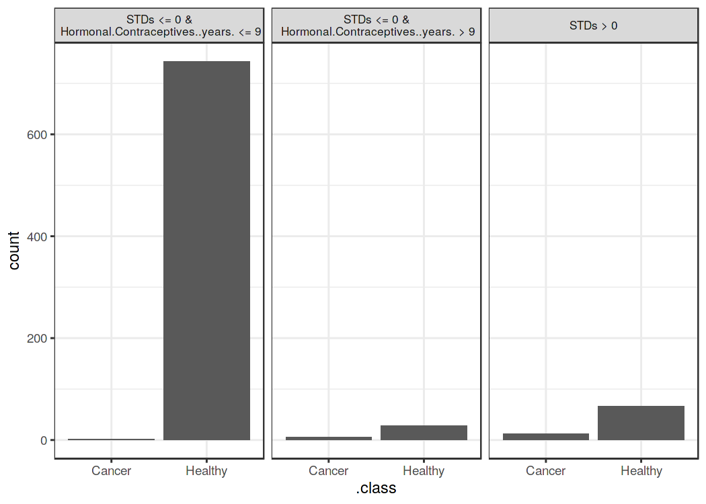

{pagebreak}

## Global Surrogate  {#global}

A global surrogate model is an interpretable model that is trained to approximate the predictions of a black box model.
We can draw conclusions about the black box model by interpreting the surrogate model.
Solving machine learning interpretability by using more machine learning!

### Theory

Surrogate models are also used in engineering:
If an outcome of interest is expensive, time-consuming or otherwise difficult to measure (e.g. because it comes from a complex computer simulation), a cheap and fast surrogate model of the outcome can be used instead. 
The difference between the surrogate models used in engineering and in interpretable machine learning is that the underlying model is a machine learning model (not a simulation) and that the surrogate model must be interpretable. 
The purpose of (interpretable) surrogate models is to approximate the predictions of the underlying model as accurately as possible and to be interpretable at the same time.
The idea of surrogate models can be found under different names:
Approximation model, metamodel, response surface model, emulator, ...

About the theory: 
There is actually not much theory needed to understand surrogate models. 
We want to approximate our black box prediction function f as closely as possible with the surrogate model prediction function g, under the constraint that g is interpretable.
For the function g any interpretable model -- for example from the [interpretable models chapter](#simple) -- can be used.

For example a linear model:

{$$}g(x)=\beta_0+\beta_1{}x_1{}+\ldots+\beta_p{}x_p{/$$}

Or a decision tree:

{$$}g(x)=\sum_{m=1}^Mc_m{}I\{x\in{}R_m\}{/$$}

Training a surrogate model is a model-agnostic method, since it does not require any information about the inner workings of the black box model, only access to data and the prediction function is necessary. 
If the underlying machine learning model was replaced with another, you could still use the surrogate method.
The choice of the black box model type and of the surrogate model type is decoupled.

Perform the following steps to obtain a surrogate model:

1. Select a dataset X. 
This can be the same dataset that was used for training the black box model or a new dataset from the same distribution.
You could even select a subset of the data or a grid of points, depending on your application. 
1. For the selected dataset X, get the predictions of the black box model.
1. Select an interpretable model type (linear model, decision tree, ...).
1. Train the interpretable model on the dataset X and its predictions.
1. Congratulations! You now have a surrogate model.
1. Measure how well the surrogate model replicates the predictions of the black box model.
1. Interpret the surrogate model.

You may find approaches for surrogate models that have some extra steps or differ a little, but the general idea is usually as described here.

One way to measure how well the surrogate replicates the black box model is the R-squared measure: 

{$$}R^2=1-\frac{SSE}{SST}=1-\frac{\sum_{i=1}^n(\hat{y}_*^{(i)}-\hat{y}^{(i)})^2}{\sum_{i=1}^n(\hat{y}^{(i)}-\bar{\hat{y}})^2}{/$$}

where {$$}\hat{y}_*^{(i)}{/$$} is the prediction for the i-th instance of the surrogate model, {$$}\hat{y}^{(i)}{/$$} the prediction of the black box model and {$$}\bar{\hat{y}}{/$$} the mean of the black box model predictions.
SSE stands for sum of squares error and SST for sum of squares total. 
The R-squared measure can be interpreted as the percentage of variance that is captured by the surrogate model. 
If R-squared is close to 1 (= low SSE), then the interpretable model approximates the behavior of the black box model very well. 
If the interpretable model is very close, you might want to replace the complex model with the interpretable model.
If the R-squared is close to 0 (= high SSE), then the interpretable model fails to explain the black box model.

Note that we have not talked about the model performance of the underlying black box model, i.e. how good or bad it performs in predicting the actual outcome. 
The performance of the black box model does not play a role in training the surrogate model.
The interpretation of the surrogate model is still valid because it makes statements about the model and not about the real world.
But of course the interpretation of the surrogate model becomes irrelevant if the black box model is bad, because then the black box model itself is irrelevant.

<!-- More ideas-->
We could also build a surrogate model based on a subset of the original data or reweight the instances.
In this way, we change the distribution of the surrogate model's input, which changes the focus of the interpretation (then it is no longer really global).
If we weight the data locally by a specific instance of the data (the closer the instances to the selected instance, the higher their weight), we get a local surrogate model that can explain the individual prediction of the instance.
Read more about local models in the [following chapter](#lime).

### Example

To demonstrate the surrogate models, we consider a regression and a classification example.

First, we train a support vector machine to predict the [daily number of rented bikes](#bike-data) given weather and calendar information.
The support vector machine is not very interpretable, so we train a surrogate with a CART decision tree as interpretable model to approximate the behavior of the support vector machine.

The surrogate model has a R-squared (variance explained) of 0.77 which means it approximates the underlying black box behavior quite well, but not perfectly.
If the fit were perfect, we could throw away the support vector machine and use the tree instead.

In our second example, we predict the probability of [cervical cancer](#cervical) with a random forest.
Again we train a decision tree with the original dataset, but with the prediction of the random forest as outcome, instead of the real classes (healthy vs. cancer) from the data.

The surrogate model has an R-squared (variance explained) of 0.2, which means it does not approximate the  random forest well and we should not overinterpret the tree when drawing conclusions about the complex model.

### Advantages 

The surrogate model method is **flexible**:
Any model from the [interpretable models chapter](#simple) can be used.
This also means that you can exchange not only the interpretable model, but also the underlying black box model.
Suppose you create some complex model and explain it to different teams in your company.
One team is familiar with linear models, the other team can understand decision trees.
You can train two surrogate models (linear model and decision tree) for the original black box model and offer two kinds of explanations.
If you find a better performing black box model, you do not have to change your method of interpretation, because you can use the same class of surrogate models.

I would argue that the approach is very **intuitive** and straightforward.
This means it is easy to implement, but also easy to explain to people not familiar with data science or machine learning.

With the **R-squared measure**, we can easily measure how good our surrogate models are in approximating the black box predictions. 

### Disadvantages

You have to be aware that you draw **conclusions about the model and not about the data**, since the surrogate model never sees the real outcome.

It is not clear what the best **cut-off for R-squared** is in order to be confident that the surrogate model is close enough to the black box model.
80% of variance explained? 50%? 99%?

We can measure how close the surrogate model is to the black box model. 
Let us assume we are not very close, but close enough. 
It could happen that the interpretable model is very **close for one subset of the dataset, but widely divergent for another subset**. 
In this case the interpretation for the simple model would not be equally good for all data points.

The interpretable model you choose as a surrogate **comes with all its advantages and disadvantages**. 

Some people argue that there are, in general, **no intrinsically interpretable models** (including even linear models and decision trees) and that it would even be dangerous to have an illusion of interpretability. 
If you share this opinion, then of course this method is not for you.

### Software

I used the `iml` R package for the examples.
If you can train a machine learning model, then you should be able to implement surrogate models yourself.
Simply train an interpretable model to predict the predictions of the black box model.

