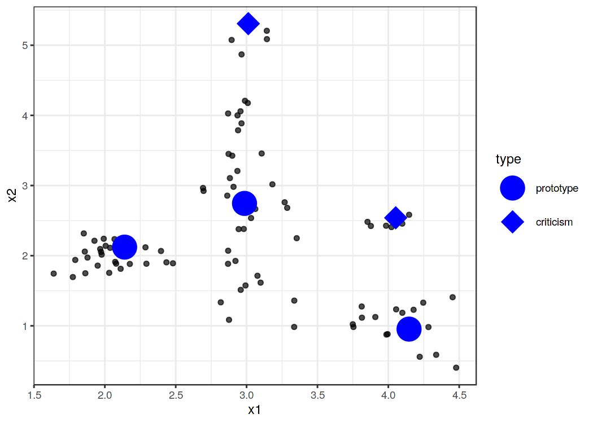
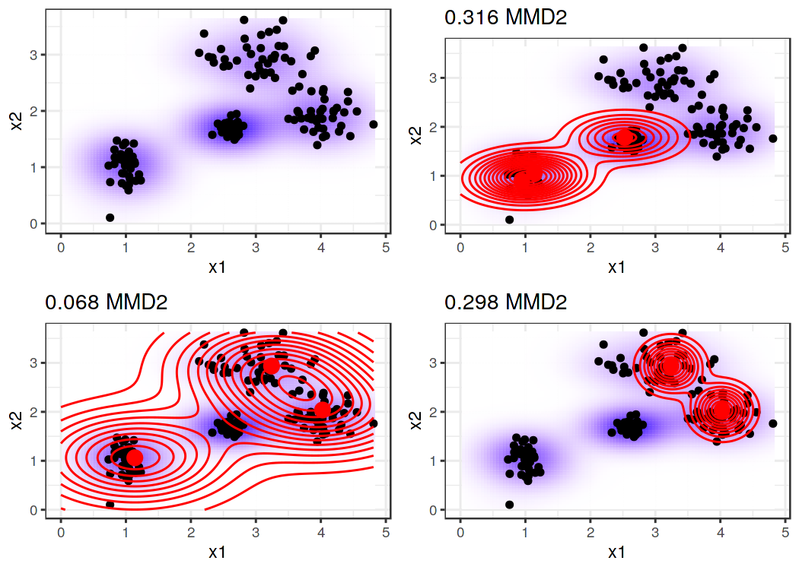
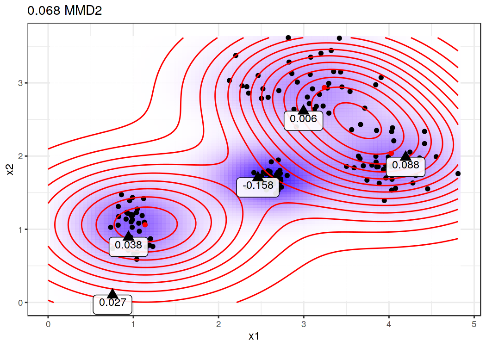

## Prototypes and Criticisms {#proto}

A **prototype** is a data instance that is representative of all the data.
Prototypes can improve the interpretability of complex data distributions, but they may not be sufficient to explain the data.
They are only sufficient if the data distribution within the classes is very homogeneous.
A **criticism** is a data instance that is not well represented by the set of prototypes.
The purpose of criticisms is to provide insights together with prototypes, especially for data points which the prototypes do not represent well.
Prototypes and criticisms can be used independently from a machine learning model to describe the data, but they can also be used to create an interpretable model or to make a black box model interpretable.

In this chapter I use the word '(data) point' to refer to a single instance, to emphasize the interpretation that an instance is also a point in a coordinate system where each feature is a dimension.
The following figure shows an artificial data distribution, with some of the instances chosen as prototypes and some as criticisms.
The small points are the data, the large points the prototypes and the large triangles are the criticisms.
The prototypes are selected (manually) to cover the centers of the data distribution and the criticisms are points in a cluster without a prototype.
Prototypes and criticisms are always actual instances from the data.

I selected the prototypes manually, which does not scale well and probably leads to poor results.
There are many approaches to find prototypes in the data. 
One of these is k-medoids, a clustering algorithm related to the k-means algorithm.
Any clustering algorithm that returns actual data points as cluster centers would qualify for selecting prototypes.
But most of these methods find only prototypes, but no criticisms.
This chapter presents MMD-critic by Kim et. al (2016)[^critique], an approach that combines finding prototypes and criticisms in a single framework.

MMD-critic compares the distribution of the data and the distribution of the selected prototypes.
This is the central concept for understanding the MMD-critic method.
MMD-critic selects prototypes that minimize the discrepancy between the two distributions.
Data points in areas with high data density are good prototypes, especially when points  are selected from different 'data clusters'.
Data points from regions that are not well explained  by the prototypes are selected as criticisms.

Let us delve deeper into the theory.

### Theory

The MMD-critic procedure on a high-level can be summarized briefly:

1. Set the number of prototypes and criticisms you want to find.
1. Select prototypes with greedy search. 
Prototypes are selected so that the distribution of the prototypes is close to the data distribution.
1. Select criticisms with greedy search. 
Points are selected as criticisms where the distribution of prototypes differs from the distribution of the data.

We need a couple of ingredients to find prototypes and criticisms for a dataset with MMD-critic.
As the most basic ingredient, we need a **kernel function** to estimate the data densities.
A kernel is a function that weights two data points according to their proximity.
Based on density estimates, we need a measure that tells us how different two distributions are so that we can determine whether the distribution of the prototypes we select is close to the data distribution.
This is solved by measuring the **maximum mean discrepancy (MMD)**.
Also based on the kernel function, we need the **witness function** to tell us how different two distribution are at a particular data point. 
With the witness function, we can select criticisms, i.e. data points at which the distribution of prototypes and data diverges and the witness function takes on large absolute values.
The last ingredient is a search strategy for good prototypes and criticisms, which is solved with a simple **greedy search**.

Let us start with the **maximum mean discrepancy (MMD)**, which measures the discrepancy between two distributions.
The selection of prototypes creates a density distribution of prototypes.
The aim of MMD-critic is to minimize the discrepancy between the distribution of the selected prototypes and the data distribution. 
We want to evaluate whether the distributions are different, based on their empirical distributions which are estimated with the help of the kernel densities.
The maximum mean discrepancy measures the difference between two distributions, which is the supremum over a function space of differences between the expectations according to the two distributions.
All clear?
Personally, I understand these concepts much better when I see how something is calculated with data.
The following formula shows how to calculate the squared MMD measure (MMD2):

{$$}MMD^2=\frac{1}{m^2}\sum_{i,j=1}^m{}k(z_i,z_j)-\frac{2}{mn}\sum_{i,j=1}^{m,n}k(z_i,x_j)+\frac{1}{n^2}\sum_{i,j=1}^n{}k(x_i,x_j){/$$}

k is a kernel function that measures the similarity of two points, but more about this later.
m is the number of prototypes z, and n is the number of data points x in our original dataset.
The prototypes z are a selection of data points x.
Each point is multidimensional, that is it can have multiple features. 
The goal of MMD-critic is to minimize MMD2.
The closer MMD2 is to zero, the better the distribution of the prototypes fits the data.
The key to bringing MMD2 down to zero is the term in the middle, which calculates the average proximity between the prototypes and all other data points (multiplied by 2).
If this term adds up to the first term (the average proximity of the prototypes to each other) plus the last term (the average proximity of the data points to each other), then the prototypes explain the data perfectly.
Try out what would happens to the formula if you used all n data points as prototypes.

The following graphic illustrates the MMD2 measure. 
The first plot shows the data points with two features, whereby the estimation of the data density is displayed with a shaded background.
Each of the other plots shows different selections of prototypes, along with the MMD2 measure in the plot titles.
The prototypes are the large red dots and their distribution is shown as contour lines.
The selection of the prototypes that best cover the data in these scenarios (bottom left) has the lowest discrepancy value.

A choice for the kernel is the radial basis function kernel:

{$$}k(x,x^\prime)=exp\left(\gamma||x-x^\prime||^2\right){/$$}
where ||x-x'|| is the Euclidean distance between two points and {$$}\gamma{/$$} is a scaling parameter. 
The value of the kernel decreases with the distance between the two points and ranges between zero and one:
Zero when the two points are infinitely far apart;
One when the two points are equal.

We combine the MMD2 measure, the kernel and greedy search in an algorithm for finding prototypes:

- Start with an empty list of prototypes.
- While the number of prototypes is below the chosen number m:
    - For each point in the dataset, check how much MMD2 is reduced when the point is added to the list of prototypes. Add the data point that minimizes the MMD2 to the list.
- Return the list of prototypes.

The remaining ingredient for finding criticisms is the witness function, which tells us how much two density estimates differ at a particular point. 
It can be estimated using:

{$$}witness(x)=\frac{1}{n}\sum_{i=1}^nk(x,x_i)-\frac{1}{m}\sum_{j=1}^mk(x,z_j){/$$}
For two datasets (with the same features), the witness function gives you the means of evaluating in which empirical distribution the point x fits more.
To find criticisms, we look for extreme values of the witness function in both negative and positive directions.
The first term in the witness function is the average proximity between point x and the prototypes, and, respectively, the second term is the average proximity between point x and the data.
If the witness function for a point x is close to zero, the density function of the data and the prototypes are close together, which means that the distribution of prototypes resembles the distribution of the data at point x.
A positive witness function at point x means that the prototype distribution overestimates the data distribution (for example if we select a prototype but there are only few data points nearby);
a negative witness function at point x means that the prototype distribution underestimates the data distribution (for example if there are many data points around x but we have not selected any prototypes nearby).

To give you more intuition, let us reuse the prototypes from the plot beforehand with the lowest MMD2 and display the witness function for a few manually selected points.
The labels in the following plot show the value of the witness function for various points marked as triangles.
Only the point in the middle has a high absolute value and is therefore a good candidate for a criticism.

The witness function allows us to explicitly search for data instances that are not well represented by the prototypes.
Criticisms are points with high absolute value in the witness function.
Like prototypes, criticisms are also found through greedy search.
But instead of reducing the overall MMD2, we are looking for points that maximize a cost function that includes the witness function and a regularizer term.
The additional term in the optimization function enforces diversity in the points, which is needed so that the points come from different clusters.

This second step is independent of how the prototypes are found.
I could also have handpicked some prototypes and used the procedure described here to learn criticisms.
Or the prototypes could come from any clustering procedure, like k-medoids.

That is it with the important parts of MMD-critic theory. 
One question remains:
**How can MMD-critic be used for interpretable machine learning?**

MMD-critic can add interpretability in three ways: 
By helping to better understand the data distribution; By building an interpretable model; By making a black box model interpretable.

If you apply MMD-critic to your data to find prototypes and criticisms, it will improve your understanding of the data, especially if you have a complex data distribution with edge cases.
But with MMD-critic you can achieve more!

For example, you can create an interpretable prediction model: a so-called 'nearest prototype model'.
The prediction function is defined as:

{$$}\hat{f}(x)=argmax_{i\in{}S}k(x,x_i){/$$}

which means that we select the prototype i from the set of prototypes S that is closest to the new data point, in the sense that it yields the highest value of the kernel function.
The prototype itself is returned as an explanation for the prediction.
This procedure has three tuning parameters: 
The type of kernel, the kernel scaling parameter and the number of prototypes.
All parameters can be optimized within a cross validation loop.
The criticisms are not used in this approach.

As a third option, we can use MMD-critic to make any machine learning model globally explainable by examining prototypes and criticisms along with their model predictions.
The procedure is as follows:

1. Find prototypes and criticisms with MMD-critic.
1. Train a machine learning model as usual.
1. Predict outcomes for the prototypes and criticisms with the machine learning model.
1. Analyse the predictions: In which cases was the algorithm wrong? 
Now you have a number of examples that represent the data well and help you to find the weaknesses of the machine learning model.

How does that help?
Remember when Google's image classifier identified black people as gorillas?
Perhaps they should have used the procedure described here before deploying their image recognition model
It is not enough just to check the performance of the model, because if it were 99% correct, this issue could still be in the 1%.
And labels can also be wrong!
Going through all the training data and performing a sanity check if the prediction is problematic might have revealed the problem, but would be infeasible.
But the selection of - say a few thousand - prototypes and criticisms is feasible and could have revealed a problem with the data:
It might have shown that there is a lack of people with dark skin in the human class, which indicates a problem with the diversity in the dataset.
Or it could have shown one or more images of a person with dark skin as a prototype or (probably) as a criticism with the notorious 'gorilla' model prediction.
I do not promise that MMD-critic would certainly intercept these kind of mistakes, but it is a good sanity check.

### Examples

I have taken the examples from the MMD-critic paper. 
Both applications are based on image datasets.
Each image was represented by image embeddings with 2048 dimensions. 
An image embedding is a vector with numbers which capture abstract attributes of an image.
Embedding vectors are usually extracted from neural networks which are trained to solve an image recognition task, in this case the ImageNet challenge.
The kernel distances between the images were calculated using these embedding vectors.

The first dataset contains different dog breeds from the ImageNet dataset.
MMD-critic is applied on data from two dog breed classes.
With the dogs on the left, the prototypes usually show the face of the dog, while the criticisms are images without the dog faces or in different colors (like black and white). 
On the right side, the prototypes contain outdoor images of dogs.
The criticisms contain dogs in costumes and other unusual cases.

Another application of MMD-critic features a handwritten digit dataset.
Each image shows a handwritten digit.

Looking at the actual prototypes and criticisms, you might notice that the number of images per digit is different. 
This is because a fixed number of prototypes and criticisms were searched across the entire dataset and not with a fixed number per class.
As expected, the prototypes show different ways of writing the digits.
The criticisms include examples with unusually thick or thin lines, but also unrecognizable digits.

### Advantages

- In a user study the authors of MMD-critic gave the test persons images, which they had to visually match to one of two sets of images, each representing one of two classes (e.g. two dog breed).
The **participants performed best when the sets showed prototypes and criticisms** instead of random images of a class.
- You are free to **choose the number of prototypes and criticisms**.
- MMD-critic works with density estimates of the data. 
This **works with any type of data and any type of machine learning model**.
- The algorithm is **easy to implement**.
- MMD-critic is very flexible in the way it is used to increase interpretability: 
It can be used to understand complex data distributions; 
It can be used to build an interpretable machine learning model; 
Or it can shed light on the decision making of a black box machine learning model.
- **Finding criticisms is independent of the selection process of the prototypes**.
But it makes sense to select prototypes according to MMD-critic, because then both prototypes and criticisms are created using the same method of comparing prototypes and data densities.

### Disadvantages

- You have to **choose the number of prototypes and criticisms**.
As much as this can be nice-to-have, it is also a disadvantage. 
How many prototypes and criticisms do we actually need?
The more the better? The less the better?
The number of prototypes and criticisms has to be determined by the user.
One solution is to choose the number of protototypes and criticisms by seeing how much time humans have to look at them, which depends on the particular application.
Only when using MMD-critic to build a classifier do we have a way to optimize it directly.
One solution could be a screeplot showing the number of prototypes on the x-axis and the MMD2 measure on the y-axis. 
We would choose the number of prototypes where the MMD2 curve flattens.
- The other parameters are the choice of the kernel and the kernel scaling parameter.
We have the same problem as with the number of prototypes and criticisms:
**How do we select a kernel and its scaling parameter?**
Again, when we use MMD-critic as a nearest prototype classifier, we can tune the kernel parameters.
For the unsupervised use cases of MMD-critic, however, it is unclear.
(Maybe I am a bit harsh here, since all unsupervised methods have this problem.)
- It takes all the features as input, **disregarding the fact that some features might not be relevant** for predicting the outcome of interest.
One solution is to use only relevant features, for example image embeddings instead of raw pixels.
This works as long as we have a way to project the original instance onto a representation that contains only relevant information.
- There is some code available, but it is **not yet implemented as nicely packaged and documented software**.

### Code and Alternatives

- An implementation of MMD-critic can be found here: [https://github.com/BeenKim/MMD-critic](https://github.com/BeenKim/MMD-critic).
- The simplest alternative to finding prototypes is [k-medoids](https://en.wikipedia.org/wiki/K-medoids) by Kaufman et. al (1987).[^medoids]

[^medoids]: Kaufman, Leonard, and Peter Rousseeuw. Clustering by means of medoids. North-Holland, 1987.

[^bcm]: Kim, B., Rudin, C., & Shah, J. (n.d.). The Bayesian Case Model: A Generative Approach for Case-Based Reasoning and Prototype Classification.

[^critique]: Kim, Been, Rajiv Khanna, and Oluwasanmi O. Koyejo. "Examples are not enough, learn to criticize! criticism for interpretability." Advances in Neural Information Processing Systems. 2016.

[^cbr]: Aamodt, A., & Plaza, E. (1994). Case-based reasoning : Foundational issues, methodological variations, and system approaches. AI Communications, 7(1), 39–59.

[^koh]: Koh, P. W., & Liang, P. (2017). Understanding Black-box Predictions via Influence Functions. Retrieved from http://arxiv.org/abs/1703.04730

